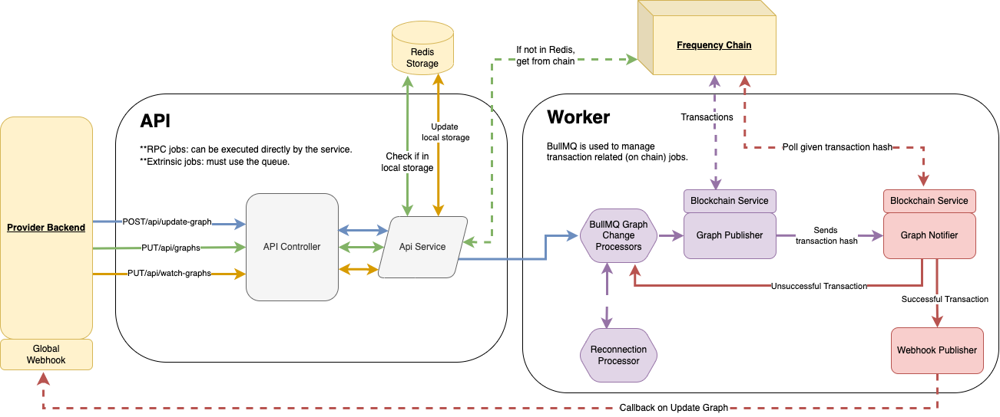

# Graph Service

<!-- TABLE OF CONTENTS -->

# 📗 Table of Contents

- [📖 About the Project](#about-project)
- [🔍 Arch Map](#-arch-maps)
- [🛠 Built With](#-built-with)
    - [Tech Stack](#tech-stack)
    - [Key Features](#key-features)
- [🚀 Live OpenAPI Docs](#-live-docs)
- [💻 Getting Started](#-getting-started)
    - [Prerequisites](#prerequisites)
    - [Setup](#setup)
    - [Install](#install)
    - [Usage](#usage)
    - [Run tests](#run-tests)
    - [Deployment](#deployment)
- [🤝 Contributing](#-contributing)
- [⭐️ Show your support](#-support)
- [🙏 Acknowledgements](#-acknowledgements)
- [❓FAQ](#faq)
- [📝 License](#-license)

<!-- PROJECT DESCRIPTION -->

# 📖 `graph-service` <a name="about-project"></a>

The Graph Service is a service enabling easy interaction with DSNP private and public graphs on Frequency.

<!-- Arch maps -->

## 🔭 Arch Maps

The account-service is a NestJS application that is split into two main parts: the API and the Worker.

The API is responsible for handling incoming HTTP requests and the Worker is responsible for processing jobs that require blockchain interaction.



<p align="right">(<a href="#-table-of-contents">back to top</a>)</p>

## 🛠 Built With <a name="built-with"></a>

### Tech Stack <a name="tech-stack"></a>

<details>
  <summary>Framework</summary>
  <ul>
    <li><a href="https://nestjs.com/">NestJS</a></li>
  </ul>
</details>

<details>
  <summary>Language</summary>
  <ul>
    <li><a href="https://www.typescriptlang.org/">Typescript</a></li>
  </ul>
</details>

<details>
  <summary>Testing Libraries</summary>
  <ul>
    <li><a href="https://jestjs.io/">Jest</a></li>
    <li><a href="https://www.npmjs.com/package/supertest">Supertest</a></li>
  </ul>
</details>

<details>
  <summary>Linting</summary>
  <ul>
    <li><a href="https://eslint.org/">ESLint</a></li>
    <li><a href="https://prettier.io/">Prettier</a></li>
  </ul>
</details>

<details>
  <summary>Data Store</summary>
  <ul>
    <li><a href="https://redis.io/">Redis</a></li>
    <ul>
      <li><a href="https://github.com/luin/ioredis">ioredis</a></li>
    </ul>
  </ul>
</details>

<details>
  <summary>Request Library</summary>
  <ul>
    <li><a href="https://axios-http.com/">Axios</a></li>
  </ul>
</details>

<details>
  <summary>Scheduling</summary>
  <ul>
    <li><a href="https://docs.nestjs.com/techniques/task-scheduling">NestJS Schedule</a></li>
  </ul>
</details>

<details>
  <summary>Validation</summary>
  <ul>
    <li><a href="https://github.com/typestack/class-validator">class-validator</a></li>
    <li><a href="https://joi.dev/">Joi</a></li>
  </ul>
</details>

<details>
  <summary>Environment Configuration</summary>
  <ul>
    <li><a href="https://github.com/motdotla/dotenv">dotenv</a></li>
  </ul>
</details>

<details>
  <summary>Containerization</summary>
  <ul>
    <li><a href="https://www.docker.com/">Docker</a></li>
    <li><a href="https://docs.docker.com/compose/">Docker Compose</a></li>
  </ul>
</details>

<details>
  <summary>API Documentation</summary>
  <ul>
    <li><a href="https://swagger.io/">Swagger</a></li>
  </ul>
</details>

<!-- Features -->

### Key Features

- **Fetch Graphs**
- **Update Graph**
- **Watch Graphs**

<p align="right">(<a href="#-table-of-contents">back to top</a>)</p>

<!-- LIVE Docs -->

## 🚀 Live Docs

- [Live Docs](https://amplicalabs.github.io/graph-service)

<p align="right">(<a href="#-table-of-contents">back to top</a>)</p>

<!-- GETTING STARTED -->

## 💻 Getting Started

To get a local copy up and running, follow these steps.

### Prerequisites

In order to run this project you need:

- [Docker](https://docs.docker.com/get-docker/)
- [Nodejs](https://nodejs.org)

### Setup

Clone this repository to your desired folder:

Example commands:

```sh
  git clone git@github.com:AmplicaLabs/graph-service.git
  cd graph-service
```

### Install

Install NPM Dependencies:

```sh
  npm install
```

### Environment Variables

The application receives its configuration from the environment. Each method of launching the app has its own source for the environment. If you run a container image using Kubernetes, it is likely your environment injection will be configured in a Helm chart. For local Docker-based development, you may specifiy the environment or point to an environment file (the included [docker-compose.yaml](./docker-compose.yaml) relies on the included [.env.docker.dev](./.env.docker.dev) file). If running natively using the script included in `package.json`, the app will use a local `.env` file.

Environment files are documented [here](./ENVIRONMENT.md), and a sample environment file is provided [here](./env.template).

1. Copy the template values into the .env files.
   ```sh
   cp env.template .env
   cp env.template .env.dev
   cp env.template .env.docker.dev
   ```
2. Replace template values with values appropriate to your environment.

### Usage

Note: using [docker compose file](docker-compose.yaml) to start the services. This will start the services in development mode.

#### 1. Start the Redis server container and the Frequency container. You can view the logs with your Docker setup.

  ```sh
  docker compose up -d redis frequency
  ```

#### 2. Once [Frequency](https://polkadot.js.org/apps/?rpc=ws%3A%2F%2F127.0.0.1%3A9944#/explorer) is up. Run a graph setup with Alice as provider 1 and 2,3,4,5,6 as users.

  ```sh
  make setup
  ```

#### 3. Run the following command to start the graph service api and worker containers. This will start the account service api and worker in development mode.

   ```sh
   docker compose up -d api worker
   ```

#### 4. Check the job in [BullUI](http://0.0.0.0:3000/queues/), to monitor job progress based on defined tests.

## 📋 Testing

### Run the tests

   ```sh
   make test-e2e
   ```

This will run the tests in `apps/api/test` folder.

#### Check e2e test file for more details on the test.

### Swagger UI
Check out the Swagger UI hosted on the app instance at [\<base url>/api/docs/swagger](http://localhost:3000/api/docs/swagger) to view the API documentation and submit requests to the service.

### Queue Management
You may also view and manage the application's queue at [\<base url>/queues](http://localhost:3000/queues).

### Linting

```sh
npm run lint
```

### Auto-format

```sh
npm run format
```

<!-- CONTRIBUTING -->

## 🤝 Contributing

Contributions, issues, and feature requests are welcome!

- [Contributing Guidelines](./CONTRIBUTING.md)
- [Open Issues](https://github.com/AmplicaLabs/graph-service/issues)

<p align="right">(<a href="#-table-of-contents">back to top</a>)</p>

<!-- SUPPORT -->

## ⭐️ Show your support

If you would like to explore contributing bug fixes or enhancements, issues with the label `good-first-issue` can be a good place to start.

<p align="right">(<a href="#-table-of-contents">back to top</a>)</p>

<!-- FAQ (optional) -->

## ❓FAQ

- **What is the difference between [Reconnection Service]() and `Graph Service`?**

    - The `Reconnection Service` is designed for providers who have users who are migrating to [DSNP](), whereas `Graph Service` is for users who are already on DSNP.

<p align="right">(<a href="#-table-of-contents">back to top</a>)</p>

<!-- LICENSE -->

## 📝 License

This project is [Apache 2.0](./LICENSE) licensed.

<p align="right">(<a href="#-table-of-contents">back to top</a>)</p>