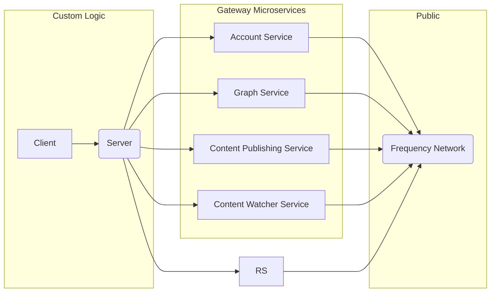

# Gateway

<!-- TABLE OF CONTENTS -->

# 📗 Table of Contents

- [📖 About the Project](#about-project)
- [🔍 Arch Map](#-arch-maps)
- [🛠 Built With](#-built-with)
  - [Tech Stack](#tech-stack)
- [🚀 Live OpenAPI Docs](#-live-docs)
- [💻 Getting Started](#-getting-started)
  - [Prerequisites](#prerequisites)
  - [Setup](#setup)
  - [Usage](#usage)
  - [Deployment](#deployment)
- [🤝 Contributing](#-contributing)
- [🙏 Acknowledgements](#-acknowledgements)
- [📝 License](#-license)

<!-- PROJECT DESCRIPTION -->

# 📖 Gateway Services <a name="about-project"></a>

Gateway is a collection of services that helps make interacting with Frequency easy as working with any web2 API!

<!-- Mermaid Arch maps -->

## 🔭 Arch Maps

### Overview Gateway Services



<p align="right">(<a href="#-table-of-contents">back to top</a>)</p>

## 🛠 Built With

Each Gateway services is an independent microservice.

### Tech Stack

<details>
<summary>Account Service</summary>

- [API Documentation](https://projectlibertylabs.github.io/gateway/account)
- [README](./services/account/README.md)

</details>

<details>
<summary>Graph Service</summary>

- [API Documentation](https://projectlibertylabs.github.io/gateway/graph/)
- [README](./services/graph/README.md)

</details>

<details>
<summary>Content Publishing Service</summary>

- [API Documentation](https://projectlibertylabs.github.io/gateway/content-publishing/)
- [README](./services/content-publishing/README.md)

</details>

<details>
<summary>Content Watcher Service</summary>

- [API Documentation](https://projectlibertylabs.github.io/gateway/content-watcher/)
- [README](./services/content-watcher/README.md)

</details>

<!-- LIVE Docs -->

## 🚀 Live Docs

- [Live Docs](https://projectlibertylabs.github.io/gateway/)

<p align="right">(<a href="#-table-of-contents">back to top</a>)</p>

<!-- GETTING STARTED -->

## 💻 Getting Started

For a more detailed tutorial, visit [Live Docs](https://projectlibertylabs.github.io/gateway/).

To get a local copy up and running, follow these steps.

### Prerequisites

In order to run this project you need:

- [Docker](https://www.docker.com) or Docker compatible layer for running Gateway Services
- [mdBook](https://rust-lang.github.io/mdBook/) for building documentation

### Setup

Clone this repository to your desired folder:

Clone:

```sh
  git clone git@github.com:ProjectLibertyLabs/gateway.git
  cd gateway
```

### Usage

To run all Gateway services, execute the following command:

```sh
  ./start-gateway.sh
```

To stop the Gateway services, execute the following command:

```sh
  ./stop-gateway.sh
```

To build the Gateway Documentation:

```sh
  cd docs
  mdbook build
```

To build and serve the Gateway Documentation:

```sh
  cd docs
  mdbook serve
```

### Deployment

Deployment of the Gateway services have various options. See the [Live Docs](https://projectlibertylabs.github.io/gateway/) for more details.

Deployment of the Gateway documentation occurs via merge to `main` branch via GitHub Actions.

<p align="right">(<a href="#-table-of-contents">back to top</a>)</p>

<!-- CONTRIBUTING -->

## 🤝 Contributing

Contributions, issues, and feature requests are welcome!

- [Contributing Guidelines](./CONTRIBUTING.md)
- [Open Issues](https://github.com/ProjectLibertyLabs/gateway/issues)

<p align="right">(<a href="#-table-of-contents">back to top</a>)</p>

<!-- ACKNOWLEDGEMENTS -->

## 🙏 Acknowledgements

Thank you to [Frequency](https://www.frequency.xyz) for assistance and documentation making this possible.

<p align="right">(<a href="#-table-of-contents">back to top</a>)</p>

<!-- LICENSE -->

## 📝 License

This project is [Apache 2.0](./LICENSE) licensed.

<p align="right">(<a href="#-table-of-contents">back to top</a>)</p>
