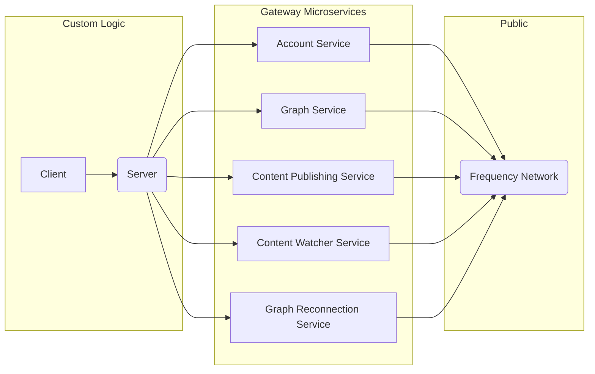

# Gateway

<!-- TABLE OF CONTENTS -->

# 📗 Table of Contents

- [📖 About the Project](#about-project)
- [🔍 Arch Map](#arch-map)
- [🛠 Built With](#built-with)
  - [Tech Stack](#tech-stack)
- [🚀 Live OpenAPI Docs](#live-docs)
- [💻 Getting Started](#getting-started)
  - [Prerequisites](#prerequisites)
  - [Setup](#setup)
  - [Usage](#usage)
  - [Deployment](#deployment)
- [🤝 Contributing](#contributing)
- [🙏 Acknowledgements](#acknowledgements)
- [❓ FAQ (OPTIONAL)](#faq)
- [📝 License](#license)

<!-- PROJECT DESCRIPTION -->

# 📖 Gateway Services <a name="about-project"></a>

Gateway is a collection of services that helps make interacting with Frequency easy as working with any web2 API!

<!-- Mermaid Arch maps -->

## 🔭 Mermaid Arch maps <a name="arch-map"></a>

### Overview Gateway Services



<p align="right">(<a href="#readme-top">back to top</a>)</p>

## 🛠 Built With <a name="built-with"></a>

Each Gateway services is an independent microservice.

### Tech Stack <a name="tech-stack"></a>

<details>
<summary>Account Service</summary>
  - [API Documentation](https://amplicalabs.github.io/account-service/)
  - [GitHub](https://github.com/AmplicaLabs/account-service)
</details>

<details>
<summary>Graph Service</summary>
  - [API Documentation](https://amplicalabs.github.io/graph-service/)
  - [GitHub](https://github.com/AmplicaLabs/graph-service)
</details>

<details>
<summary>Content Publishing Service</summary>
  - [API Documentation](https://amplicalabs.github.io/content-publishing-service/)
  - [GitHub](https://github.com/AmplicaLabs/content-publishing-service)
</details>

<details>
<summary>Content Watcher Service</summary>
  - [API Documentation](https://amplicalabs.github.io/content-watcher-service/)
  - [GitHub](https://github.com/AmplicaLabs/content-watcher-service)
</details>

<details>
<summary>Reconnection Service</summary>
  - [API Documentation](https://amplicalabs.github.io/reconnection-service/)
  - [GitHub](https://github.com/AmplicaLabs/reconnection-service)
</details>

<!-- LIVE Docs -->

## 🚀 Live Docs <a name="live-docs"></a>

- [Live Docs](https://amplicalabs.github.io/gateway/)

<p align="right">(<a href="#readme-top">back to top</a>)</p>

<!-- GETTING STARTED -->

## 💻 Getting Started <a name="getting-started"></a>

For a more detailed tutorial, visit [Live Docs](https://amplicalabs.github.io/gateway/).

To get a local copy up and running, follow these steps.

### Prerequisites

In order to run this project you need:

- [Docker](https://www.docker.com) or Docker compatible layer for running Gateway Services
- [mdBook](https://rust-lang.github.io/mdBook/) for building documentation

### Setup

Clone this repository to your desired folder:

Clone:

```sh
  git clone git@github.com:AmplicaLabs/gateway.git
  cd gateway
```

### Usage

To run all Gateway services, execute the following command:

```sh
  docker compose docker-compose.all.yaml
```

To build the Gateway Documentation:

```sh
  cd docs
  mdbook build
```

To build and serve the Gateway Documentation:

```sh
  cd docs
  mdbook serve
```

### Deployment

Deployment of the Gateway services have various options. See the [Live Docs](https://amplicalabs.github.io/gateway/) for more details.

Deployment of the Gateway documentation occurs via merge to `main` branch via GitHub Actions.

<p align="right">(<a href="#readme-top">back to top</a>)</p>

<!-- CONTRIBUTING -->

## 🤝 Contributing <a name="contributing"></a>

Contributions, issues, and feature requests are welcome!

- [Contributing Guidelines](./CONTRIBUTING.md)
- [Open Issues](https://github.com/AmplicaLabs/gateway/issues)
- See also the repositories of the individual services.

<p align="right">(<a href="#readme-top">back to top</a>)</p>

<!-- ACKNOWLEDGEMENTS -->

## 🙏 Acknowledgments <a name="acknowledgements"></a>

Thank you to [Frequency](https://www.frequency.xyz) for assistance and documentation making this possible.

<p align="right">(<a href="#readme-top">back to top</a>)</p>

<!-- LICENSE -->

## 📝 License <a name="license"></a>

This project is [Apache 2.0](./LICENSE) licensed.

<p align="right">(<a href="#readme-top">back to top</a>)</p>
````
