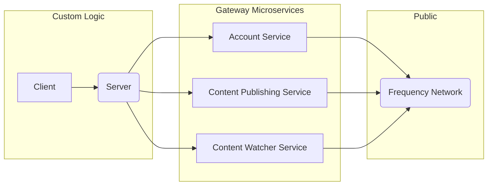

# Frequency Developer Gateway

Frequency Developer Gateway is a suite of microservices designed to simplify interactions with the Frequency blockchain,
bridging the gap between Web2 and Web3 development.

[](https://github.com/ProjectLibertyLabs/gateway/actions/workflows/release.yml)
[](https://github.com/ProjectLibertyLabs/gateway/actions/workflows/deploy-gh-pages.yaml)

<!-- TABLE OF CONTENTS -->

# 📗 Table of Contents

- [📖 About the Project](#about-project)
- [🚀 Live OpenAPI Docs](#-live-docs)
- [🔍 Architecture Map](#-arch-maps)
- [🔍 Gateway Microservices](#gateway-microservices)
- [💻 Getting Started](#getting-started)
    - [🚀 Quick Start Guide](#quick-start-guide)
    - [💻 Getting Started with Microservices](#microservices-start-guide)
- [🛫 Deployment](#deployment)
- [📝 Logging](#logging)
- [📊 Metrics](#metrics)
- [⚡ Load and Stress Testing](#load-testing)
- [🤝 Contributing](#-contributing)
- [🙏 Acknowledgments](#-acknowledgments)
- [📝 License](#-license)

<!-- PROJECT DESCRIPTION -->

# 📖 Frequency Developer Gateway Services <a name="about-project"></a>

Gateway is a collection of services designed to simplify interactions with the Frequency blockchain. It bridges the gap
between Web2 and Web3, allowing developers to interact with Frequency as easily as they would with any traditional Web2
API.

## Architecture Summary

### Monorepo Structure:

- Applications (7 services): 3 APIs, 3 workers and 1 watcher
- Libraries (14 libraries): Shared functionality and utilities

### API Services & Workers

- Account (account-api + account-worker): User account management and blockchain interactions
- Content Publishing (content-publishing-api + content-publishing-worker): Content creation and publishing to blockchain
- Content Watcher (content-watcher): Monitors blockchain for content changes

### Shared Libraries

- Blockchain: Polkadot/Frequency chain interactions
- Queue: BullMQ job processing
- Cache: Redis caching layer
- Storage: File/IPFS storage
- Config: Environment configuration
- Types: Shared TypeScript definitions

### Technology Stack

- Framework: NestJS with TypeScript
- Blockchain: Polkadot API for Frequency chain
- Storage: IPFS, file system
- Caching: Redis with Ioredis
- Queues: BullMQ for background jobs
- Documentation: OpenAPI/Swagger
- Testing: Jest
- Infrastructure: Docker, Kubernetes ready

### Key Features

- Modular architecture: Use each service independently to fit your specific needs
- Simplified blockchain interactions: Abstract away complex blockchain operations
- Web2-like experience: Familiar REST API patterns for Web2 developers
- Background Processing: Async job queues for blockchain operations
- Monitoring: Prometheus metrics and structured logging
- Developer-Friendly: Comprehensive documentation and testing

For a practical implementation example, check out our **Social App Template
** [here](https://github.com/ProjectLibertyLabs/social-app-template), which demonstrates how to integrate these services
into a full-fledged application.

<p align="right">(<a href="#-table-of-contents">back to top</a>)</p>

## 🚀 Live Docs <a name="-live-docs"></a>

Visit our Live API Documentation to start exploring the Gateway services.

**[Access Our Live API Docs Here](https://projectlibertylabs.github.io/gateway/)**

<p align="right">(<a href="#-table-of-contents">back to top</a>)</p>

<!-- Mermaid Arch maps -->

## 🔭 Architecture Maps <a name="-arch-maps"></a>

### Overview Gateway Services



<p align="right">(<a href="#-table-of-contents">back to top</a>)</p>

## 🔍 Gateway Microservices <a name="gateway-microservices"></a>

Gateway consists of four independent microservices, each designed to handle specific aspects of interaction with the
Frequency blockchain. Below is a detailed overview of each service:

| Service                    | Description                                                                                                                                                                                                    | API Documentation                                                            | README                                                  |
|----------------------------|----------------------------------------------------------------------------------------------------------------------------------------------------------------------------------------------------------------|------------------------------------------------------------------------------|---------------------------------------------------------|
| Account Service            | Manages user accounts and authentication on the Frequency blockchain using [Sign In With Frequency](https://github.com/ProjectLibertyLabs/siwf). It handles tasks such as account creation and key management. | [API Docs](https://projectlibertylabs.github.io/gateway/account)             | [README](./developer-docs/account/README.md)            |
| Content Publishing Service | Facilitates the creation and publication of content on the Frequency blockchain. It manages tasks such as posting messages, attachments, replies, and reactions.                                               | [API Docs](https://projectlibertylabs.github.io/gateway/content-publishing/) | [README](./developer-docs/content-publishing/README.md) |
| Content Watcher Service    | Monitors and retrieves content updates from the Frequency blockchain. It allows applications to efficiently track new content as it's published.                                                               | [API Docs](https://projectlibertylabs.github.io/gateway/content-watcher/)    | [README](./developer-docs/content-watcher/README.md)    |

<p align="right">(<a href="#-table-of-contents">back to top</a>)</p>

### Key Features of Gateway Microservices

- **Modularity**: Each service can be used independently, allowing developers to integrate only the functionalities they
  need.
- **Scalability**: The microservice architecture allows for easy scaling of individual services based on demand.
- **Simplified Blockchain Interaction**: These services abstract complex blockchain operations, providing a familiar
  API-based interface for developers.
- **Comprehensive Documentation**: Each service comes with detailed API documentation and a README file for easy
  integration and usage.

<p align="right">(<a href="#-table-of-contents">back to top</a>)</p>

<!-- GETTING STARTED -->

## 💻 Getting Started <a name="getting-started"></a>

Gateway offers flexibility in how you can use its services. You can either quickly set up all services or selectively
use specific microservices based on your needs. Below, we provide both a Quick Start guide for setting up all services
and information on how to get started with individual microservices.

### 🚀 Quick Start Guide <a name="quick-start-guide"></a>

Follow these steps to quickly get all Gateway services up and running:

1. **Prerequisites**:
   In order to run this project you need:

- [Docker](https://www.docker.com) or Docker compatible layer for running Gateway Services
- [mdBook](https://rust-lang.github.io/mdBook/) for building documentation

2. **Clone the Repository**:

```sh
  git clone git@github.com:ProjectLibertyLabs/gateway.git
  cd gateway
```

3. **Start all Services (local and testnet development only)**

```sh
  ./start.sh
```

This script will start all Gateway microservices using Docker.
It is **not designed to run against mainnet;** it's intended for local development or testing against Paseo Testnet.
If you run a local Frequency node via start.sh, it will be its own isolated chain, not connected to mainnet or testnet.

4. **Stop all Services (local and testnet development only)**

```sh
  ./stop.sh
```

Use this script when you need to stop all running Gateway services.

5. **Build Gateway Documentation**

```sh
  # First time installation only
  cargo install mdbook@0.4.52
  cargo install mdbook-mermaid@0.15.0

  cd docs
  npm install
  mdbook build
```

6. **Build and Serve Gateway Documentation**

```sh
  cd docs
  mdbook serve
```

### 💻 Getting Started with Microservices <a name="microservices-start-guide"></a>

To begin using these microservices:

1. Decide which services your application needs.
2. Review the API documentation for each required service. See
   the [Live Docs](https://projectlibertylabs.github.io/gateway/) or <a name="gateway-microservices">README</a> for more
   details.
3. Integrate the service APIs into your application using the documentation as a guide.

For a practical example of how these services can be used together, check out
our [Social App Template](https://github.com/ProjectLibertyLabs/social-app-template).

<p align="right">(<a href="#-table-of-contents">back to top</a>)</p>

## 🛫 Deployment <a name="deployment"></a>

To prepare for deployment, you can use the start and stop scripts against a local node and Paseo testnet.
For deployment, it is recommended to set up your mainnet Gateway instance in a cloud environment.

Deployment of each Gateway _service_ has various options. See
the [Live Docs](https://projectlibertylabs.github.io/gateway/) for more details.

Deployment of the Gateway _documentation_ occurs via merge to `main` branch via GitHub Actions.

<p align="right">(<a href="#-table-of-contents">back to top</a>)</p>

## 📝 Logging <a name="logging"></a>

Gateway uses Pino for logging. By default, the log output is JSON formatted.

Set LOG_LEVEL to one of `error`, `warn`, `info`, `debug`, or `trace` from least to most verbose.  
Default is `info`.

In addition, if PRETTY=true is set in the .env file for a given app, this applies the pino-pretty decorator in the logs,
for a colorized, more human-readable format.

## 📊 Metrics <a name="metrics"></a>

For each app - account-api, account-worker, content-publishing-api, content-publishing-worker, and content-watcher - Gateway exposes the default
Prometheus metrics at `/metrics`.
A local Prometheus server can be installed and pointed at this endpoint for debugging or other purposes.

## ⚡ Load and Stress Testing <a name="load-testing"></a>

Gateway includes [Grafana k6](https://k6.io/) load and stress testing capabilities across microservices to ensure
reliability, performance, and scalability under various load conditions.

**Key Features:**

- **Health Check Testing**: Basic service availability validation
- **Load Testing**: Multiple scenarios (light, medium, heavy, burst) for performance validation
- **Stress Testing**: Advanced stress scenarios with multiple phases
- **File Upload Testing**: Size-specific testing for content publishing
- **Test Data Generation**: Realistic data generation to avoid blockchain interaction

**Quick Start:**

```bash
# Run health check for any service
cd apps/[service-name]/k6-test
k6 run health-check.k6.js

# Run load testing with specific scenario
cd apps/content-publishing-api/k6-test
SCENARIO=heavy k6 run batch-announcement-load.k6.js
```

Detailed information, configuration options, and best practices, are included in our *
*[k6 testing documentation](./docs/k6/k6-documentation.md)**.

<!-- CONTRIBUTING -->

## 🤝 Contributing <a name="-contributing"></a>

Contributions, issues, and feature requests are welcome!

- [Contributing Guidelines](./CONTRIBUTING.md)
- [Open Issues](https://github.com/ProjectLibertyLabs/gateway/issues)
- [Contributor Notes](./developer-docs/CONTRIBUTOR-NOTES.md)

<p align="right">(<a href="#-table-of-contents">back to top</a>)</p>

<!-- ACKNOWLEDGMENTS -->

## 🙏 Acknowledgments <a name="-acknowledgments"></a>

Thank you to [Frequency](https://www.frequency.xyz) for assistance and documentation making this possible.

<p align="right">(<a href="#-table-of-contents">back to top</a>)</p>

<!-- LICENSE -->

## 📝 License <a name="-license"></a>

This project is [Apache 2.0](./LICENSE) licensed.

<p align="right">(<a href="#-table-of-contents">back to top</a>)</p>
