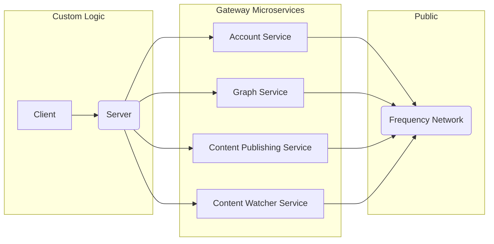

# Gateway

Gateway is a suite of microservices designed to simplify interactions with the Frequency blockchain, bridging the gap between Web2 and Web3 development.

<!-- TABLE OF CONTENTS -->

# 📗 Table of Contents

- [📖 About the Project](#about-project)
- [🚀 Live OpenAPI Docs](#-live-docs)
- [🔍 Architecture Map](#-arch-maps)
- [🔍 Gateway Microservices](#gateway-microservices)
- [💻 Getting Started](#getting-started)
  - [🚀 Quick Start Guide](#quick-start-guide)
  - [💻 Microservice Start Guide](#microservices-start-guide)
- [🛫 Deployment](#deployment)
- [🤝 Contributing](#-contributing)
- [🙏 Acknowledgements](#-acknowledgements)
- [📝 License](#-license)

<!-- PROJECT DESCRIPTION -->

# 📖 Gateway Services <a name="about-project"></a>

Gateway is a collection of services designed to simplify interactions with the Frequency blockchain. It bridges the gap between Web2 and Web3, allowing developers to interact with Frequency as easily as they would with any traditional Web2 API.

Key features:

- Modular architecture: Use each service independently to fit your specific needs
- Simplified blockchain interactions: Abstract away complex blockchain operations
- Web2-like experience: Familiar REST API patterns for Web2 developers

For a practical implementation example, check out our **Social App Template** [here](https://github.com/ProjectLibertyLabs/social-app-template), which demonstrates how to integrate these services into a full-fledged application.

<p align="right">(<a href="#-table-of-contents">back to top</a>)</p>

## 🚀 Live Docs <a name="-live-docs"></a>

Visit our Live API Documentation to start exploring the Gateway services.

**[Access Our Live API Docs Here](https://projectlibertylabs.github.io/gateway/)**

<p align="right">(<a href="#-table-of-contents">back to top</a>)</p>

<!-- Mermaid Arch maps -->

## 🔭 Architecture Maps <a name="-arch-maps"></a>

### Overview Gateway Services



<p align="right">(<a href="#-table-of-contents">back to top</a>)</p>

## Gateway Microservices <a name="gateway-microservices"></a>

Gateway consists of four independent microservices, each designed to handle specific aspects of interaction with the Frequency blockchain. Below is a detailed overview of each service:

| Service                    | Description                                                                                                                                                                                                    | API Documentation                                                            | README                                                  |
| -------------------------- | -------------------------------------------------------------------------------------------------------------------------------------------------------------------------------------------------------------- | ---------------------------------------------------------------------------- | ------------------------------------------------------- |
| Account Service            | Manages user accounts and authentication on the Frequency blockchain using [Sign In With Frequency](https://github.com/ProjectLibertyLabs/siwf). It handles tasks such as account creation and key management. | [API Docs](https://projectlibertylabs.github.io/gateway/account)             | [README](./developer-docs/account/README.md)            |
| Graph Service              | Manages social connections and relationships between users on the Frequency network. It handles operations like following/unfollowing users and retrieving social graphs.                                      | [API Docs](https://projectlibertylabs.github.io/gateway/graph/)              | [README](./developer-docs/graph/README.md)              |
| Content Publishing Service | Facilitates the creation and publication of content on the Frequency blockchain. It manages tasks such as posting messages, attachments, replies, and reactions.                                               | [API Docs](https://projectlibertylabs.github.io/gateway/content-publishing/) | [README](./developer-docs/content-publishing/README.md) |
| Content Watcher Service    | Monitors and retrieves content updates from the Frequency blockchain. It allows applications to efficiently track new content as it's published.                                                               | [API Docs](https://projectlibertylabs.github.io/gateway/content-watcher/)    | [README](./developer-docs/content-watcher/README.md)    |

<p align="right">(<a href="#-table-of-contents">back to top</a>)</p>

### Key Features of Gateway Microservices

- **Modularity**: Each service can be used independently, allowing developers to integrate only the functionalities they need.
- **Scalability**: The microservice architecture allows for easy scaling of individual services based on demand.
- **Simplified Blockchain Interaction**: These services abstract complex blockchain operations, providing a familiar API-based interface for developers.
- **Comprehensive Documentation**: Each service comes with detailed API documentation and a README file for easy integration and usage.

<p align="right">(<a href="#-table-of-contents">back to top</a>)</p>

<!-- GETTING STARTED -->

## 💻 Getting Started <a name="getting-started"></a>

Gateway offers flexibility in how you can use its services. You can either quickly set up all services or selectively use specific microservices based on your needs. Below, we provide both a Quick Start guide for setting up all services and information on how to get started with individual microservices.

### 🚀 Quick Start Guide <a name="quick-start-guide"></a>

Follow these steps to quickly get all Gateway services up and running:

1. **Prerequisites**:
   In order to run this project you need:

- [Docker](https://www.docker.com) or Docker compatible layer for running Gateway Services
- [mdBook](https://rust-lang.github.io/mdBook/) for building documentation

2. **Clone the Repository**:

```sh
  git clone git@github.com:ProjectLibertyLabs/gateway.git
  cd gateway
```

3. **Start all Services**

```sh
  ./start.sh
```

This script will start all Gateway microservices using Docker.

4. **Stop all Services**

```sh
  ./stop.sh
```

Use this script when you need to stop all running Gateway services.

5. **Build Gateway Documentation**

```sh
  cd docs
  mdbook build
```

6. **Build and Serve Gateway Documentation**

```sh
  cd docs
  mdbook serve
```

### Getting Started with Microservices <a name="microservices-start-guide"></a>

To begin using these microservices:

1. Decide which services your application needs.
2. Review the API documentation for each required service. See the [Live Docs](https://projectlibertylabs.github.io/gateway/) or <a name="gateway-microservices">README</a> for more details.
3. Integrate the service APIs into your application using the documentation as a guide.

For a practical example of how these services can be used together, check out our [Social App Template](https://github.com/ProjectLibertyLabs/social-app-template).

<p align="right">(<a href="#-table-of-contents">back to top</a>)</p>

## Deployment <a name="deployment"></a>

Deployment of the Gateway services have various options. See the [Live Docs](https://projectlibertylabs.github.io/gateway/) for more details.

Deployment of the Gateway documentation occurs via merge to `main` branch via GitHub Actions.

<p align="right">(<a href="#-table-of-contents">back to top</a>)</p>

<!-- CONTRIBUTING -->

## 🤝 Contributing

Contributions, issues, and feature requests are welcome!

- [Contributing Guidelines](./CONTRIBUTING.md)
- [Open Issues](https://github.com/ProjectLibertyLabs/gateway/issues)
- [Contributor Notes](./developer-docs/CONTRIBUTOR-NOTES.md)

<p align="right">(<a href="#-table-of-contents">back to top</a>)</p>

<!-- ACKNOWLEDGEMENTS -->

## 🙏 Acknowledgements

Thank you to [Frequency](https://www.frequency.xyz) for assistance and documentation making this possible.

<p align="right">(<a href="#-table-of-contents">back to top</a>)</p>

<!-- LICENSE -->

## 📝 License

This project is [Apache 2.0](./LICENSE) licensed.

<p align="right">(<a href="#-table-of-contents">back to top</a>)</p>
