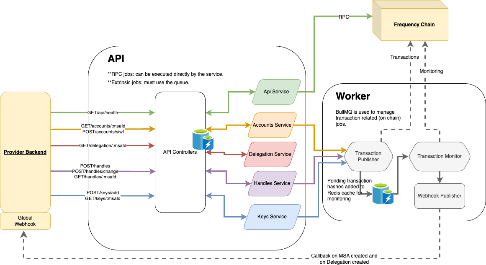

# Account Service

The Account Service is a crucial component of the Gateway suite, enabling easy interaction with DSNP accounts on
Frequency. This document provides an overview of the service, its architecture, and guides for setup and usage.

## 📗 Table of Contents

- [📖 About the Project](#about-project)
- [🔍 Architecture Overview](#architecture-overview)
- [🔑 Key Features](#key-features)
- [💻 Getting Started](#getting-started)
- [🚀 API Documentation](#api-documentation)
- [🛠 Development](#development)
- [BullMQ Queues list](#bullmq-queues)
- [🤝 Contributing](#contributing)
- [❓ FAQ](#faq)
- [📝 License](#license)

## 📖 About the Project <a name="about-project"></a>

The Account Service simplifies the management of user accounts, defined by a user's handle and MSA Id (Message Source
Account Identifier) on the [Frequency](https://docs.frequency.xyz/) blockchain using [DSNP](https://dsnp.org/)
protocols.

## 🔍 Architecture Overview <a name="architecture-overview"></a>

The Account Service is built using NestJS and is divided into two main components:

1. **API**: Handles incoming HTTP requests
2. **Worker**: Processes jobs that require blockchain interaction



## 🔑 Key Features <a name="key-features"></a>

- Account creation using [SIWF](https://github.com/ProjectLibertyLabs/siwf) (Sign-In With Frequency)
- User and Provider Account management
- Handle (username) claiming and management
- Key management (adding and retrieving keys)
- Delegation info retrieval for MSA Id
- Seamless integration with Web3 wallets

## 💻 Getting Started <a name="getting-started"></a>

This section will guide you through setting up the Account Service for both quick start and local development.

### Prerequisites

Ensure you have the following installed:

- [Node.js](https://nodejs.org)
- [Docker](https://docs.docker.com/get-docker/)

### Quick Start

1. Clone the repository and navigate to the project directory:

   ```bash
   git clone https://github.com/ProjectLibertyLabs/gateway.git
   cd gateway
   ```

2. Copy the environment template:

   ```bash
   cp env-files/account.template.env .env.account
   ```

   Ensure that the `.env.account` file is correctly configured for your environment. For more information, refer to
   the [Environment Variables](ENVIRONMENT.md) section in the full documentation. Specifically, you will need to set the
   `FREQUENCY_API_WS_URL`, etc., to the correct network (e.g., `wss://0.rpc.testnet.amplica.io`).

3. Install dependencies:

   ```bash
   npm install
   ```

4. Start supporting services (local frequency node, redis) using Docker:

   ```bash
   ./scripts/account/restart-chain-docker.sh
   ```

5. Start account service api and worker applications using Docker:

   ```bash
   docker compose -f docker-compose.yaml -f docker-compose-e2e.account.yaml --profile account up -d
   ```

### Local Development (without containers)

If you prefer to run services locally for development:

1. Start Redis and Frequency:

   ```bash
   ./scripts/account/restart-local-dev.sh
   ```

2. Start the mock webhook server (in a new terminal):

   ```bash
   cd webhook-servers && cargo run
   ```

3. Start the API (in a new terminal):

   ```bash
   npm run start:account-api:dev
   ```

4. Start the Worker (in another new terminal):

   ```bash
   npm run start:account-worker:dev
   ```

### Verification

- Access Swagger UI: [http://localhost:3000/api/docs/swagger](http://localhost:3000/api/docs/swagger)
- View and manage queues: [http://localhost:3000/queues](http://localhost:3000/queues)

### Next Steps

After setting up the Account Service, you can:

- Explore the API using the Swagger UI
- Run the test suite to ensure everything is working correctly
- Start integrating the Account Service into your application

For more detailed setup instructions, environment variable configuration, and advanced usage, please refer to
our [comprehensive documentation](#).

## 🚀 API Documentation <a name="api-documentation"></a>

### Live OpenAPI Docs

Explore our [Live API Documentation](https://projectlibertylabs.github.io/account-service) for detailed information on
endpoints and usage.

## 🛠 Development <a name="development"></a>

This section covers testing, debugging, linting, and information about the technologies used in the Account Service.

### Testing

Run E2E tests:

```bash
make test-e2e-account
```

Access Swagger UI: [http://localhost:3000/api/docs/swagger](http://localhost:3000/api/docs/swagger)

Manage queues: [http://localhost:3000/queues](http://localhost:3000/queues)

### Linting

To run the linter:

```bash
npm run lint
```

To automatically fix linting issues:

```bash
npm run format
```

### Debugging

#### Using Docker

To stop containers, networks, volumes, and images created by `docker compose up`, run:

```bash
docker compose down
```

Note: You may need to manually remove containers using the Docker Desktop app.

#### Using the Debugger with VSCode

1. Follow step 1 from the Development Environment section above to set up the Redis and Frequency containers.

2. Use the debug panel and start the `Debug Api (NestJS via ts-node)` configuration to debug the API.

   Use the debug panel and start the `Debug Worker (NestJS via ts-node)` configuration to debug the worker.

3. Set breakpoints in the code and debug your code.

4. Monitor the service worker jobs in [BullUI](http://0.0.0.0:3000/queues/).

   Any API functions that require an extrinsic to be submitted to the blockchain will be queued here. The queue will
   manage the amount of `capacity` this service is allowed to use.

5. Use [Swagger](http://0.0.0.0:3000/api/docs/swagger) to test the API.

Reference the [Frequency Docs](https://docs.frequency.xyz/) for more information about extrinsics and capacity.

**Note:** Reference `.vscode/launch.json` for more details on the debug configurations and apply the concepts to your
preferred debugger.

## BullMQ Queues

Each queue lists the [DTOs](https://en.wikipedia.org/wiki/Data_transfer_object) used with it.

* transactionPublish - the sole queue for all Account operations, with
  related [DTOs](https://en.wikipedia.org/wiki/Data_transfer_object).
    * Managing handles: `CreateHandleRequest`, `ChangeHandleRequest`
    * Managing control keys: `AddKeyRequestDto` `PublicKeyAgreementDto`
    * Handling SIWF sign up requests: `PublishSIWFSignupRequestDto`
    * Retiring an MSA. `PublishRetireMsaRequestDto`
    * Revoking a delegation to the Provider operating this gateway: `PublishRevokeDelegationRequestDto`

### Built With

- **Framework**: NestJS
- **Language**: TypeScript
- **Testing**: Jest, Supertest
- **Data Store**: ioredis
- **API Documentation**: Swagger
- **Containerization**: Docker, Docker Compose

For a complete list of technologies used, please refer to the [Tech Stack](/README.md#tech-stack) section in the full
documentation.

## 🤝 Contributing <a name="contributing"></a>

We welcome contributions! Please check our [Contributing Guidelines](./CONTRIBUTING.md)
and [open issues](https://github.com/ProjectLibertyLabs/gateway/issues).

## ❓ FAQ <a name="faq"></a>

**Q: Can I use this service in my production social app?**

_Yes, Gateway Services are designed to be ready-to-use out of the box for social media apps using DSNP on Frequency._

**Q: Will the Account Service scale for large applications?**

_The service is designed to support small-to-medium-sized social apps. For larger use cases, custom solutions may be
necessary._

## 📝 License <a name="license"></a>

This project is licensed under the [Apache 2.0 License](./LICENSE).

<p align="right">(<a href="#-table-of-contents">back to top</a>)</p>
