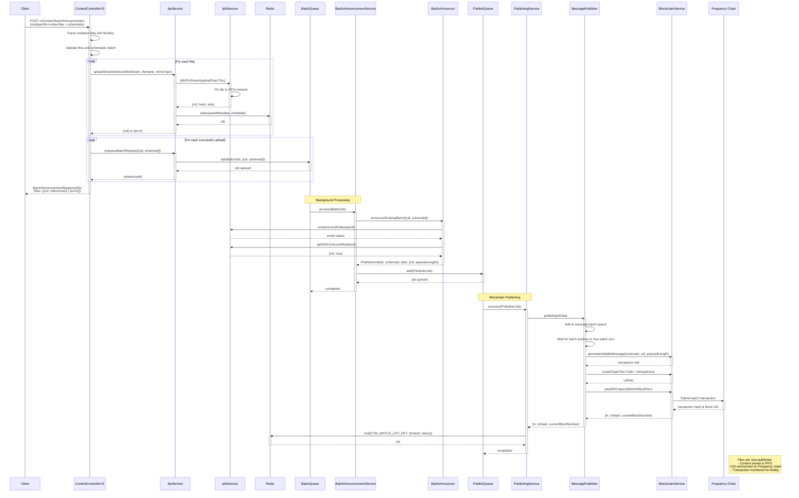

# Batch File Publishing Flow

Illustrates the flow of batch file publishing from the content-publisher API at `v3/content/batchAnnouncement`, to
pinning on IPFS, to announcing on the Frequency blockchain.
[SVG Version](./content-publishing-v3.svg) of this diagram

