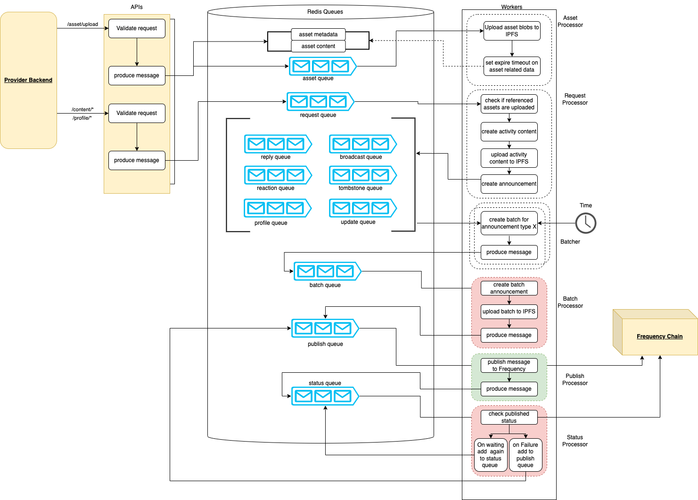

# Content Publisher Service

The Content Publisher Service is a crucial component of the Gateway suite, providing a familiar REST API for uploading content and publishing announcements to the Frequency blockchain. This document provides an overview of the service, its architecture, and guides for setup and usage.

## 📗 Table of Contents

- [📖 About the Project](#about-project)
- [🔍 Architecture Overview](#architecture-overview)
- [🔑 Key Features](#key-features)
- [💻 Getting Started](#getting-started)
- [🚀 API Documentation](#api-documentation)
- [🛠 Development](#development)
- [🤝 Contributing](#contributing)
- [❓ FAQ](#faq)
- [📝 License](#license)

## 📖 About the Project <a name="about-project"></a>

The Content Publisher Service is part of the Gateway suite that provides a Web2-friendly interface for blockchain content operations. It handles all necessary blockchain interactions, allowing clients to use familiar REST API patterns for publishing and managing content on the Frequency chain.

## 🔍 Architecture Overview <a name="architecture-overview"></a>

The Content Publisher Service consists of two main components:

1. **API Controller**: Handles incoming HTTP requests and enqueues content publishing tasks
2. **Worker Process**: Processes queued tasks and interacts with the blockchain

The API and Worker processes communicate via a shared BullMQ message queue.



## 🔑 Key Features <a name="key-features"></a>

### Content Management

- **Upload asset files**: Handle file uploads to the system
- **Create broadcasts**: Publish new posts to the network
- **Create replies**: Respond to existing content
- **Create reactions**: Add reactions to content
- **Update content**: Modify existing content
- **Delete content**: Remove content (via tombstones)
- **Update profiles**: Manage user profile information

### Development Features

- **Job management**: Monitor and manage publishing jobs
- **Asset retrieval**: Access stored assets
- **Test data**: Generate sample announcement data

## 💻 Getting Started <a name="getting-started"></a>

This section guides you through setting up the Content Publisher Service for both development and deployment.

### Prerequisites

Ensure you have the following installed:

- [Node.js](https://nodejs.org)
- [Docker](https://docs.docker.com/get-docker/)

### Quick Start

1. Clone the repository and navigate to the project directory:

   ```bash
   git clone https://github.com/ProjectLibertyLabs/gateway.git
   cd gateway
   ```

2. Install dependencies:

   ```bash
   npm install
   ```

3. Set up environment variables:

   ```bash
   cp env-files/content-publishing.template.env .env.content-publishing
   ```

   Configure the environment variables according to your needs.

4. Start auxiliary services:

   ```bash
   docker compose up -d frequency redis ipfs
   ```

5. Start the application services:

   API Service:

   ```bash
   npm run start:content-publishing-api:dev
   ```

   Worker Service:

   ```bash
   npm run start:content-publishing-worker:dev
   ```

6. Set up with account data:
   ```bash
   make setup-account
   ```

### Alternative: Docker Setup

1. Run services using Docker:

   ```bash
   docker compose up -d frequency content-publishing-service-api content-publishing-service-worker
   ```

2. Set up with account data:
   ```bash
   make setup-account
   ```

### Verification

#### Docker Setup

- Access Swagger UI: [http://localhost:3012/docs/swagger](http://localhost:3012/docs/swagger)
- View and manage queues: [http://localhost:3012/queues](http://localhost:3012/queues)

#### Local Development Setup

- Access Swagger UI: [http://localhost:3000/docs/swagger](http://localhost:3000/docs/swagger)
- View and manage queues: [http://localhost:3000/queues](http://localhost:3000/queues)

## 🚀 API Documentation <a name="api-documentation"></a>

- [Live API Documentation](https://projectlibertylabs.github.io/gateway)

## 🛠 Development <a name="development"></a>

### Testing

Run the test:

```bash
npm test:content-publising
```

Run E2E tests:

```bash
npm run test:e2e:content-publishing
```

### Linting and Formatting

Run linter:

```bash
npm run lint
```

Auto-format code:

```bash
npm run format
```

### Built With

- **Server Framework**: NestJS, Node.js, TypeScript
- **Data Store**: Redis (ioredis)
- **Queue System**: BullMQ
- **Blockchain Integration**: Polkadot API, DSNP
- **Testing**: Jest, Supertest
- **Documentation**: Swagger
- **Containerization**: Docker, Docker Compose

## 🤝 Contributing <a name="contributing"></a>

We welcome contributions! Please check our [Contributing Guidelines](./CONTRIBUTING.md) and [open issues](https://github.com/ProjectLibertyLabs/gateway/issues).

## ❓ FAQ <a name="faq"></a>

**Q: Can I use this service in my production social app?**

_Yes, Gateway Services are designed to be ready-to-use out of the box as part of your own social media app using DSNP on Frequency._

## 📝 License <a name="license"></a>

This project is licensed under the [Apache 2.0 License](./LICENSE).

<p align="right">(<a href="#-table-of-contents">back to top</a>)</p>
