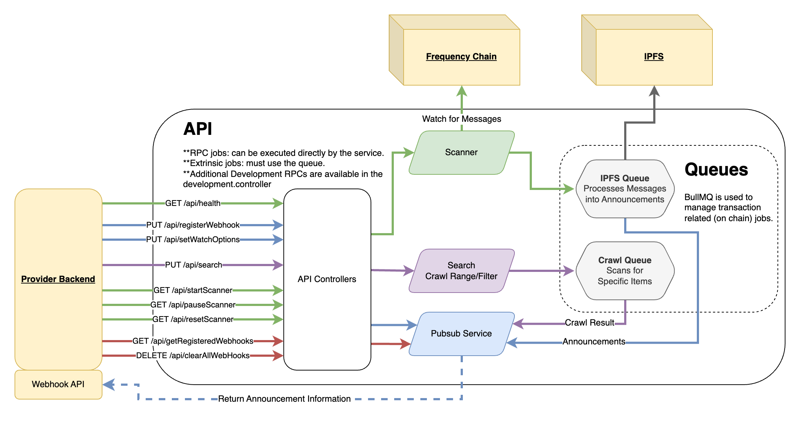

# Content Watcher Service

The Content Watcher Service is a crucial component of the Gateway suite, providing a familiar callback API to retrieve content and publishing announcements from the Frequency blockchain. This document provides an overview of the service, its architecture, and guides for setup and usage.

## 📗 Table of Contents

- [📖 About the Project](#about-project)
- [🔍 Architecture Overview](#architecture-overview)
- [🔑 Key Features](#key-features)
- [💻 Getting Started](#getting-started)
- [🚀 API Documentation](#api-documentation)
- [🛠 Development](#development)
- [🤝 Contributing](#contributing)
- [❓ FAQ](#faq)
- [📝 License](#license)

## 📖 About the Project <a name="about-project"></a>

The Content Watcher Service is part of the [Gateway](https://github.com/ProjectLibertyLabs/gateway) suite that provides a Web2-friendly interface for monitoring and retrieving blockchain announcements through a webhook system.

On Frequency, announcements about content (posts, replies, reactions) are stored on-chain, while the content itself is stored off-chain. The Content Watcher Service simplifies the process of monitoring these announcements by automatically watching the blockchain, processing new announcements as they appear, and delivering them to your application in a familiar format through webhooks.

## 🔍 Architecture Overview <a name="architecture-overview"></a>

The Content Watcher Service provides a webhook-based system for receiving notifications about new content.



## 🔑 Key Features <a name="key-features"></a>

### Content Monitoring
- **Parse DSNP Messages**: Monitor and parse messages on Frequency
- **Webhook Integration**: Send content to registered webhooks
- **Flexible Filtering**: Simple Schema and MSA Id based filtering

### Scanner Operations
- **Start/Stop Control**: Manage scanning operations
- **Restart Capability**: Reset and restart scanning processes
- **Block Range Scanning**: Specify custom block ranges for content retrieval

## 💻 Getting Started <a name="getting-started"></a>

This section guides you through setting up the Content Watcher Service for both development and deployment.

### Prerequisites

Ensure you have the following installed:
- [Node.js](https://nodejs.org)
- [Docker](https://docs.docker.com/get-docker/)

### Quick Start with Docker

1. Clone the repository and navigate to the project directory:
   ```bash
   git clone https://github.com/ProjectLibertyLabs/gateway
   cd gateway
   ```

2. Install dependencies:
   ```bash
   npm install
   ```

3. Start auxiliary services:
   ```bash
   docker compose up -d frequency redis ipfs
   ```

4. Start the Content Watcher Service:
   ```bash
   docker compose up -d content-watcher-service
   ```

### Local Development Setup

1. Start required services:
   ```bash
   docker compose up -d frequency redis ipfs
   ```

2. Set up environment variables:
   ```bash
   cp env-files/content-watcher.template .env.content-watcher
   ```
   Configure the environment variables according to your needs.

2. Start Content-Watcher
   ```bash
   npm run start:content-watcher:dev
   ```

### Optional Setup Steps

1. Set up publishing services:
   ```bash
   docker compose up -d content-publishing-service-api content-publishing-service-worker
   ```

2. Initialize basic publisher:
   ```bash
   npm run setup:content-publishing:chain
   ```

3. Start test webhook:
   ```bash
   npm run setup:content-watcher:webhook
   ```

4. Generate test content:
   ```bash
   npm run setup:content-watcher:publish
   ```

### Verification

#### Docker Setup
- Access Swagger UI: [http://localhost:3011/api/docs/swagger](http://localhost:3014/api/docs/swagger)
- View and manage queues: [http://localhost:3011/queues](http://localhost:3014/queues)

#### Local Development Setup
- Access Swagger UI: [http://localhost:3000/api/docs/swagger](http://localhost:3000/api/docs/swagger)
- View and manage queues: [http://localhost:3000/queues](http://localhost:3000/queues)

## 🚀 API Documentation <a name="api-documentation"></a>

- [Live API Documentation](https://projectlibertylabs.github.io/gateway/)


## 🛠 Development <a name="development"></a>

### Testing

Run unit tests:
```bash
npm run test:content-watcher
```

Run E2E tests:
```bash
make test-content-watcher-services-start

npm run test:e2e:content-watcher
```

### Linting and Formatting

Run linter:
```bash
npm run lint
```

Auto-format code:
```bash
npm run format
```

### Built With

- **Server Framework**: NestJS, Node.js, TypeScript
- **Data Store**: Redis (ioredis)
- **Queue System**: BullMQ
- **Blockchain Integration**: Polkadot API, DSNP
- **Testing**: Jest, Supertest
- **Documentation**: Swagger
- **Containerization**: Docker, Docker Compose

## 🤝 Contributing <a name="contributing"></a>

We welcome contributions! Please check our [Contributing Guidelines](https://github.com/ProjectLibertyLabs/gateway/blob/main/CONTRIBUTING.md) and [open issues](https://github.com/ProjectLibertyLabs/gateway/issues).

## ❓ FAQ <a name="faq"></a>

**Q: Can I use this service in my production social app?**

_Yes, Gateway Services are designed to be ready-to-use out of the box as part of your social media app using DSNP on Frequency._

**Q: Does this service index content?**

_No. This can be used by your own indexing service to get access to the content, but the service is intentionally limited to getting the content and further customization is open to you._

**Q: Does this service filter content?**

_No. This can be used by your own content filtering service to get new content and then have your custom service process them._

## 📝 License <a name="license"></a>

This project is licensed under the [Apache 2.0 License](./LICENSE).

<p align="right">(<a href="#-table-of-contents">back to top</a>)</p>
