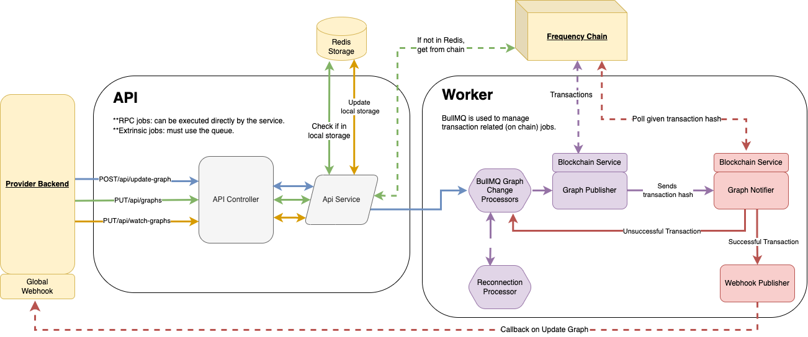

# Graph Service

The Graph Service is a crucial component of the Gateway suite, enabling easy interaction with DSNP private and public graphs on the Frequency blockchain. This document provides an overview of the service, its architecture, and guides for setup and usage.

## 📗 Table of Contents

- [📖 About the Project](#about-project)
- [🔍 Architecture Overview](#architecture-overview)
- [🔑 Key Features](#key-features)
- [💻 Getting Started](#getting-started)
- [🚀 API Documentation](#api-documentation)
- [🛠 Development](#development)
- [🤝 Contributing](#contributing)
- [❓ FAQ](#faq)
- [📝 License](#license)

## 📖 About the Project <a name="about-project"></a>

The Graph Service simplifies the management and interaction with DSNP (Decentralized Social Networking Protocol) private and public graphs on the Frequency blockchain. It provides an easy-to-use interface for fetching, updating, and watching graphs.

## 🔍 Architecture Overview <a name="architecture-overview"></a>

The Graph Service is built using NestJS and is divided into two main components:

1. **API**: Handles incoming HTTP requests
2. **Worker**: Processes jobs that require blockchain interaction



## 🔑 Key Features <a name="key-features"></a>

- **Fetch Graphs**: Retrieve social connection data
- **Update Graph**: Modify social connections
- **Watch Graphs**: Monitor changes in social graphs

## 💻 Getting Started <a name="getting-started"></a>

This section will guide you through setting up the Graph Service using either Docker or local development.

### Prerequisites

Ensure you have the following installed:
- [Node.js](https://nodejs.org)
- [Docker](https://docs.docker.com/get-docker/)

### Quick Start with Docker

1. Clone the repository and navigate to the project directory:
   ```bash
   git clone https://github.com/ProjectLibertyLabs/gateway.git
   cd gateway
   ```

2. Install dependencies:
   ```bash
   npm install
   ```

3. Set up environment variables:
   ```bash
   cp env-files/graph.template.env .env
   ```
   Edit the `.env` file with appropriate values for your environment.

4. Start all services using Docker Compose:
   ```bash
   docker compose up -d redis frequency graph-service-api graph-service-worker
   ```

5. Set up with account data:
   ```bash
   make setup-account
   ```

### Local Development (without containers)

If you prefer to run services locally for development:

1. Start Redis and Frequency:
   ```bash
   docker compose up -d redis frequency
   ```

2. Set up with account data:
   ```bash
   make setup-account
   ```

3. Start the Graph Service API:
   ```bash
   make start-graph-api
   ```

4. Start the Graph Service Worker:
   ```bash
   make start-graph-worker
   ```

### Verification

#### Docker Setup
- Access Swagger UI: [http://localhost:3012/docs/swagger](http://localhost:3012/docs/swagger)
- View and manage queues: [http://localhost:3012/queues](http://localhost:3012/queues)

#### Local Development Setup
- Access Swagger UI: [http://localhost:3000/docs/swagger](http://localhost:3000/docs/swagger)
- View and manage queues: [http://localhost:3000/queues](http://localhost:3000/queues)

For more detailed setup instructions, environment variable configuration, and advanced usage, please refer to our [comprehensive documentation](#).

## 🚀 API Documentation <a name="api-documentation"></a>

Explore our [Live API Documentation](https://projectlibertylabs.github.io/gateway) for detailed information on endpoints and usage.

## 🛠 Development <a name="development"></a>

This section covers testing, debugging, linting, and information about the technologies used in the Graph Service.

### Testing

Run E2E tests:
```bash
npm run test:e2e:graph
```

### Linting

To run the linter:
```bash
npm run lint
```

To automatically fix linting issues:
```bash
npm run format
```

### Built With

- **Framework**: NestJS
- **Language**: TypeScript
- **Testing**: Jest, Supertest
- **Data Store**: Redis (ioredis)
- **API Documentation**: Swagger
- **Containerization**: Docker, Docker Compose

For a complete list of technologies used, please refer to the [Tech Stack](#tech-stack) section in the full documentation.

## 🤝 Contributing <a name="contributing"></a>

We welcome contributions! Please check our [Contributing Guidelines](./CONTRIBUTING.md) and [open issues](https://github.com/ProjectLibertyLabs/graph-service/issues).

## ❓ FAQ <a name="faq"></a>

**Q: What is the difference between Reconnection Service and Graph Service?**

*The Reconnection Service is designed for providers who have users migrating to DSNP, whereas the Graph Service is for users who are already on DSNP or don't need to migrate pre-DSNP users.*

## 📝 License <a name="license"></a>

This project is licensed under the [Apache 2.0 License](./LICENSE).

<p align="right">(<a href="#-table-of-contents">back to top</a>)</p>
