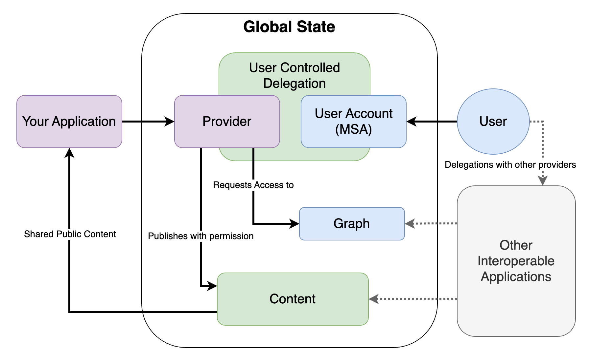

# Core Concepts

## Global State

Frequency provides a shared global state to make interoperability and user control fundamental to the internet.
Applications provide unique experiences to their users while accessing the content and graph connections from other applications.
Just like how the internet is a shared global network, your applications can break out of their artificial boundaries.

## User Control with Delegation

Users are at the core of every application and network.
Users must maintain ultimate control, but delegation to your application gives you the ability to provide seamless experiences for your users and their data.

Learn more about Delegation in [Frequency Documentation](https://docs.frequency.xyz/Delegation/).

## Interoperability Between Apps

Frequency enables seamless interaction and data sharing between different applications built on its platform.
This interoperability is facilitated by:

- **Standardized Protocols:** Frequency uses the Decentralized Social Networking Protocol (DSNP), an open Web3 protocol that ensures compatibility between different applications.
- **Common Data Structures:** By using standardized data structures for user profiles, messages, and other social interactions, Frequency ensures that data can be easily shared and interpreted across different applications.
- **User Control:** Users can switch between different applications without losing their social connections or content, ensuring continuity and control over their digital presence.

By leveraging these principles and infrastructures, Frequency provides a robust platform for developing decentralized social applications that are secure, scalable, and user-centric.

## Learn More

- [Frequency Documentation](https://docs.frequency.xyz)
- [DSNP Specification](https://spec.dsnp.org)
