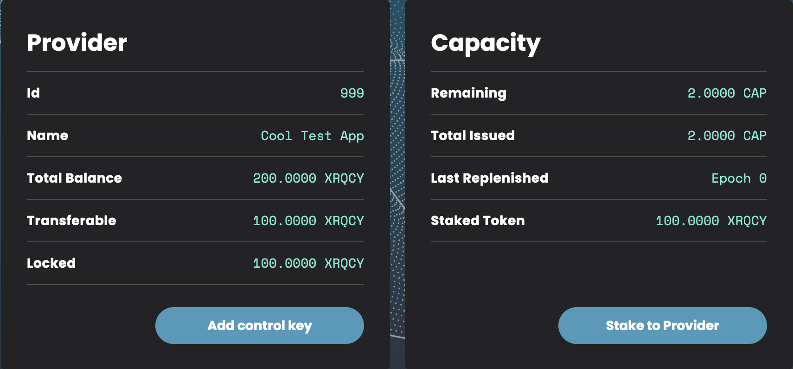
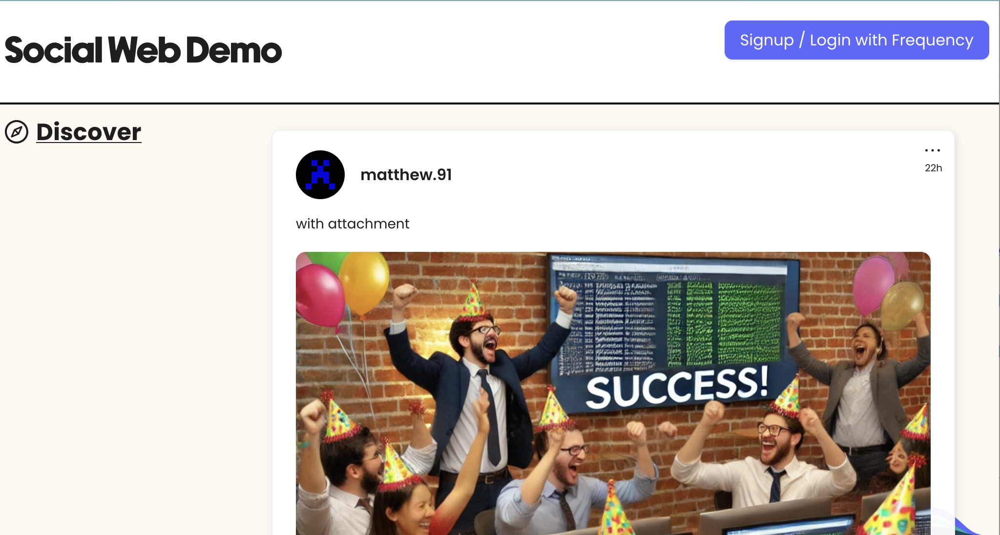
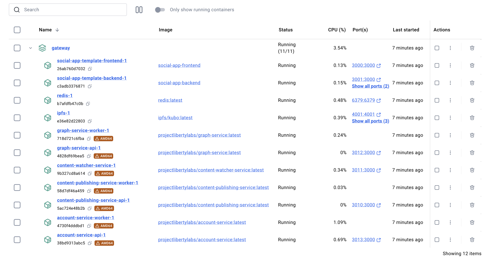

# Getting Started

In this tutorial, you will setup the [Social App Template](https://github.com/ProjectLibertyLabs/social-app-template) Example Application that uses Gateway Services.
These will all run locally and connect to the public Frequency Testnet.
This will give you a quick introduction to a working integration with Gateway Services and a starting place to explore the possibilities.

Expected Time: ~5 minutes

> **Version Compatibility:** This guide uses Gateway Services v1.5+ which includes Sign In With Frequency (SIWF) v2 support, enhanced credential management with W3C Verifiable Credentials, and improved microservice architecture with dedicated worker services. If you're using the Social App Template, ensure it's compatible with Gateway v1.5+.

## **Step 1: Prerequisites**

Before you begin, ensure you have the following installed on your machine:

- [Git](https://git-scm.com)
- [Docker](https://www.docker.com)
- [Node.js](https://nodejs.org) (v22 or higher recommended)
- A Web3 Polkadot wallet (_e.g._ [Polkadot extension](https://polkadot.js.org/extension/))

> **Note:** This setup uses **Sign In With Frequency (SIWF) v2**, which integrates with [Frequency Access](https://frequencyaccess.com/) to provide easy, custodial wallet authentication for your users. SIWF v1 is deprecated. Learn more in the [SSO Guide](./SSO.md).

## **Step 2: Register on Testnet**

To have your application interact on Frequency Testnet, you will need to register as a Provider.
This will enable users to delegate to you, and your chain actions to be free via [Capacity](https://docs.frequency.xyz/Tokenomics/ProviderIncentives.html).

### Create an Application Account in a Wallet

- Open a wallet extension such as the [Polkadot extension](https://polkadot.js.org/extension/)
- Follow account creation steps
- _Make sure to keep the seed phrase for the service configuration step_

[Detailed Instructions](https://support.polkadot.network/support/solutions/articles/65000098878-how-to-create-a-polkadot-account)

### Acquire Testnet Tokens

Visit the Frequency Testnet Faucet and get tokens: [Testnet Faucet](https://faucet.testnet.frequency.xyz/)

### Create a Provider

Creating your provider account is easy via the [Provider Dashboard](https://provider.frequency.xyz/).

- Use the same browser with the wallet extension
- Visit the [Provider Dashboard](https://provider.frequency.xyz/)
- Select `Become a Provider`
- Select the `Testnet Paseo` network
- Connect the Application Account created earlier
- Select `Create an MSA` and approve the transaction popups
- Choose a public Provider name (e.g. "Cool Test App") and continue via `Create Provider`
- Stake for Capacity by selecting `Stake to Provider` and stake 100 XRQCY Tokens



## **Step 3: Configure and Run the Example**

### Clone the Example Repository

```sh
git clone https://github.com/ProjectLibertyLabs/social-app-template.git
```

```sh
cd social-app-template
```

### Run the Configuration Script

```sh
./start.sh
```

#### Testnet Setup Help

Use default values when uncertain.

- `Do you want to start on Frequency Paseo Testnet?` Yes!
- `Enter Provider ID` This is Provider Id from the Provider Dashboard
- `Enter Provider Seed Phrase` This is the seed phrase saved from the wallet setup
- `Do you want to change the IPFS settings?`
  - No if this is just a test run
  - Yes, if you want to use an [IPFS pinning service](https://docs.ipfs.tech/how-to/work-with-pinning-services/#use-a-third-party-pinning-service)

> **Configuration Note:** The setup automatically configures SIWF v2 authentication with Frequency Access. The Frequency RPC endpoint used is `wss://0.rpc.testnet.amplica.io` for Testnet Paseo.

## **Step 4: Done & What Happened?**

You should now be able to access the Social App Template at [http://localhost:3000](http://localhost:3000)!



### What happened in the background?

All the different services needed were started in Docker. Gateway Services consists of **7 microservices** working together:

- **Account API & Worker**: User account management and authentication with SIWF v2
- **Content Publishing API & Worker**: Content creation and publishing to blockchain
- **Graph API & Worker**: Social graph and relationship management
- **Content Watcher**: Monitors blockchain for content changes and updates

Each service has dedicated API and worker components for better scalability and performance.



## **Step 5: Shutdown**

Stop all the Docker services via the script (with the option to remove saved data), or just use Docker Desktop.

```sh
./stop.sh
```

## **What's Next?**

### Explore the API Documentation

Open the OpenAPI/Swagger Documentation for each service:

- **Account Service**: [Local](http://localhost:3013/docs/swagger) | [Public](https://projectlibertylabs.github.io/gateway/account/)
  - Account Worker: [Public Docs](https://projectlibertylabs.github.io/gateway/account-worker/)
- **Graph Service**: [Local](http://localhost:3012/docs/swagger) | [Public](https://projectlibertylabs.github.io/gateway/graph/)
  - Graph Worker: [Public Docs](https://projectlibertylabs.github.io/gateway/graph-worker/)
- **Content Publishing Service**: [Local](http://localhost:3010/docs/swagger) | [Public](https://projectlibertylabs.github.io/gateway/content-publishing/)
  - Content Publishing Worker: [Public Docs](https://projectlibertylabs.github.io/gateway/content-publishing-worker/)
- **Content Watcher Service**: [Local](http://localhost:3011/docs/swagger) | [Public](https://projectlibertylabs.github.io/gateway/content-watcher/)

### Learn More

- [Learn about each service](../Build/)
- [Read about Running in Production](../Run/)
- [SIWF v2 Documentation](https://projectlibertylabs.github.io/siwf/v2/docs) - Deep dive into authentication
- [Frequency Access](https://frequencyaccess.com/) - User-friendly custodial wallet
- [Troubleshooting Guide](../Troubleshooting.md) - Common issues and solutions

### New Features in Gateway v1.5+

- **SIWF v2 Authentication**: Enhanced security and user experience with Frequency Access integration
- **W3C Verifiable Credentials**: Support for email, phone number, and private graph key credentials
- **7 Microservices Architecture**: Complete suite including dedicated worker services for improved scalability
- **Enhanced Webhooks**: Real-time updates for account and graph changes
- **Schema-Based Permissions**: Granular delegation control based on Frequency schemas
- **Improved Performance**: Optimized background job processing with BullMQ workers
