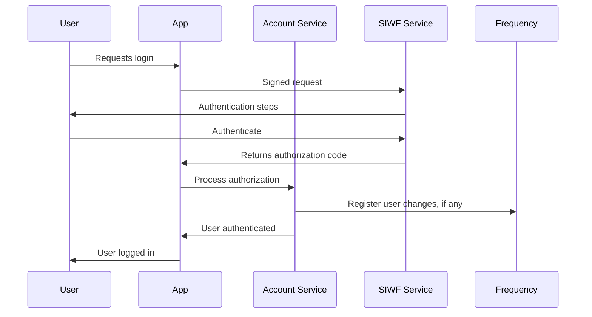

# Fast Single Sign On with SIWF v2 with Account Service

Sign In With Frequency (SIWF v2) is quick, user-friendly, decentralized authentication using the Frequency blockchain.
Coupled with the Account Service, this provides fast and secure SSO across applications by utilizing cryptographic
signatures to verify user identities without complex identity management systems.

Key benefits:

- Decentralized authentication
- Integration with the identity system on Frequency
- Support for multiple credentials (e.g., email, phone)
- Secure and fast user onboarding

Resources:

- [SIWF v2 Documentation](https://projectlibertylabs.github.io/siwf/v2/docs)
- [SIWF v2 SDKs](https://projectlibertylabs.github.io/siwf/v2/docs/SDK/Overview.html)
- [Account Service Documentation](../Build/AccountService/AccountService.md)

## **Setup Tutorial**

In this tutorial, you will set up a Sign In With Frequency button for use with Testnet, which will enable you to acquire
onboarded, authenticated users with minimal steps.

## **Prerequisites**

Before proceeding, ensure you have completed the following steps:

**Registered as a Provider**
Register your application as a [Provider on Frequency Testnet](./BecomeProvider.md).

**Completed the Access Form**
Fill out
the [Frequency Access Testnet Account Setup form](https://docs.google.com/forms/d/e/1FAIpQLScN_aNMZpYqEdchSHrAR6MhKrVI1pA3SP6wxolAQCFckYoPOA/viewform).

**Set Up a Backend Instance**
You need a **backend-only-accessible** [running instance](../Run/GatewayServices/RunGatewayServices.md) of the Account
Service.

**Access to a Frequency RPC Node**

- Public Testnet Node: `wss://0.rpc.testnet.amplica.io`

## **Overview**

1. Application creates a signed request SIWF URL that contains a callback URL.
2. User clicks a button that uses the signed request URL.
3. User visits the SIWF v2 compatible service (e.g. Frequency Access).
4. User is processed by the service.
5. User returns with the callback URL.
6. Application has the Account Service validate and process registration on Frequency if needed.
7. User is authenticated.



## **Step 1: Generate a SIWF v2 Signed Request**

The User will be redirected to a service for generating their signed authentication.

### Option A: Static Callback and Permissions

If a static callback and permissions are all that is required, a static Signed Request may be generated and
used: [Signed Request Generator Tool](https://projectlibertylabs.github.io/siwf/v2/docs/Generate.html)

### Option B: Dynamic Callback or Permissions

A dynamic signed request allows for user-specific callbacks.
While this is not needed for most applications, some situations require it.

The Account Service provides an API to generate the Signed Request URL:

- [GET
  `/v2/accounts/siwf`](https://projectlibertylabs.github.io/gateway/account/#tag/v2accounts/operation/AccountsControllerV2_getRedirectUrl)

<div class="warning">
Remember that the Account Service is NOT meant to be an externally exposed service.
It should be configured in an appropriately isolated network environment, and your application backend will need to make the call securely.
</div>

```bash
curl -X GET "https://account-service.internal/v2/accounts/siwf?callbackUrl=https://app.example.com/callback"
```

### Selecting Permissions for Delegation

Permissions define the actions that you as the Application can perform on behalf of the user.
They are based on Schemas published to Frequency.

See list
of [SIWF v2 Available Delegations](https://projectlibertylabs.github.io/siwf/v2/docs/Delegations.html#available-delegations).

### Requesting Credentials

SIWF v2 supports requesting validated credentials such as a phone number, email, and private graph keys.

See list
of [SIWF v2 Credentials](https://projectlibertylabs.github.io/siwf/v2/docs/Credentials.html#available-credentials).

## **Step 2: Forward the User for Authentication**

### Option A: SIWF Button SDK

The SIWF SDK provides an easy way to use your `signedRequest` and display a button for your users.

The example below is with the SIWF SDK for the Web.
Guides for Android, iOS that also support handling the callback correctly and more are
available [in the SIWF SDK documentation](https://projectlibertylabs.github.io/siwf/v2/docs/SDK/Overview.html).

```html
<!-- Add a button container with data attributes and replace "YOUR_ENCODED_SIGNED_REQUEST" with your "signedRequest" value -->
<div data-siwf-button="YOUR_ENCODED_SIGNED_REQUEST" data-siwf-mode="primary" data-siwf-endpoint="mainnet"></div>
<!-- Include the latest version of the script -->
<script src="https://cdn.jsdelivr.net/npm/@projectlibertylabs/siwf-sdk-web@1.0.1/siwf-sdk-web.min.js"></script>
```

### Option B: Manually

Redirect the user to the URL obtained from the previous step:

```javascript
window.location.href = '"https://testnet.frequencyaccess.com/siwa/start?signedRequest=eyJyZXF1ZXN0ZWRTaWduYXR1cmVzIjp7InB1YmxpY0tleSI6eyJlbmNvZGVkVmFsdWUiOiJmNmNMNHdxMUhVTngxMVRjdmRBQk5mOVVOWFhveUg0N21WVXdUNTl0elNGUlc4eURIIiwiZW5jb2RpbmciOiJiYXNlNTgiLCJmb3JtYXQiOiJzczU4IiwidHlwZSI6IlNyMjU1MTkifSwic2lnbmF0dXJlIjp7ImFsZ28iOiJTUjI1NTE5IiwiZW5jb2RpbmciOiJiYXNlMTYiLCJlbmNvZGVkVmFsdWUiOiIweDNlMTdhYzM3Yzk3ZWE3M2E3YzM1ZjBjYTJkZTcxYmY3MmE5NjlkYjhiNjQyYzU3ZTI2N2Q4N2Q1OTA3ZGM4MzVmYTJjODI4MTdlODA2YTQ5NGIyY2E5Y2U5MjJmNDM1NDY4M2U4YzAxMzY5NTNlMGZlNWExODJkMzU0NjQ2Yzg4In0sInBheWxvYWQiOnsiY2FsbGJhY2siOiJodHRwOi8vbG9jYWxob3N0OjMwMDAiLCJwZXJtaXNzaW9ucyI6WzUsNyw4LDksMTBdfX0sInJlcXVlc3RlZENyZWRlbnRpYWxzIjpbeyJ0eXBlIjoiVmVyaWZpZWRHcmFwaEtleUNyZWRlbnRpYWwiLCJoYXNoIjpbImJjaXFtZHZteGQ1NHp2ZTVraWZ5Y2dzZHRvYWhzNWVjZjRoYWwydHMzZWV4a2dvY3ljNW9jYTJ5Il19LHsiYW55T2YiOlt7InR5cGUiOiJWZXJpZmllZEVtYWlsQWRkcmVzc0NyZWRlbnRpYWwiLCJoYXNoIjpbImJjaXFlNHFvY3poZnRpY2k0ZHpmdmZiZWw3Zm80aDRzcjVncmNvM29vdnd5azZ5NHluZjQ0dHNpIl19LHsidHlwZSI6IlZlcmlmaWVkUGhvbmVOdW1iZXJDcmVkZW50aWFsIiwiaGFzaCI6WyJiY2lxanNwbmJ3cGMzd2p4NGZld2NlazVkYXlzZGpwYmY1eGppbXo1d251NXVqN2UzdnUydXducSJdfV19XX0&mode=dark"';
```

For mobile applications, use an embedded browser to handle the redirection smoothly with minimal impact on user
experience.
SDKs for [Android](https://projectlibertylabs.github.io/siwf/v2/docs/SDK/Android.html)
and [iOS](https://projectlibertylabs.github.io/siwf/v2/docs/SDK/iOS.html) are available that handle this part for you.

## **Step 3: Handle the Callback**

After the user completes authentication, Frequency Access or other SIWF v2 Service will redirect the user to your
`callbackUrl` with either an `authorizationCode` or `authorizationPayload`.

The Account Service provides an API to validate and process the SIWF v2 authorization:

- [POST
  `/v2/accounts/siwf`](https://projectlibertylabs.github.io/gateway/account/#tag/v2accounts/operation/AccountsControllerV2_postSignInWithFrequency)

<div class="warning">
Remember that the Account Service is NOT meant to be an externally exposed service.
It should be configured in an appropriately isolated network environment, and your Application backend will need to make the call securely.
</div>

```bash
curl -X POST "https://account-service.internal/v2/accounts/siwf" \
  -H "Content-Type: application/json" \
  -d '{
    "authorizationCode": "received-code",
  }'
```

The response will include the user's credentials, control key, and more:

```json
{
  "controlKey": "f6cL4wq1HUNx11TcvdABNf9UNXXoyH47mVUwT59tzSFRW8yDH",
  "msaId": "314159265358979323846264338",
  "email": "user@example.com",
  "phoneNumber": "555-867-5309",
  "graphKey": "f6Y86vfvou3d4RGjYJM2k5L7g1HMjVTDMAtVMDh8g67i3VLZi",
  "rawCredentials": [
    {
      "@context": [
        "https://www.w3.org/ns/credentials/v2",
        "https://www.w3.org/ns/credentials/undefined-terms/v2"
      ],
      "type": [
        "VerifiedEmailAddressCredential",
        "VerifiableCredential"
      ],
      "issuer": "did:web:frequencyaccess.com",
      "validFrom": "2024-08-21T21:28:08.289+0000",
      "credentialSchema": {
        "type": "JsonSchema",
        "id": "https://schemas.frequencyaccess.com/VerifiedEmailAddressCredential/bciqe4qoczhftici4dzfvfbel7fo4h4sr5grco3oovwyk6y4ynf44tsi.json"
      },
      "credentialSubject": {
        "id": "did:key:z6QNucQV4AF1XMQV4kngbmnBHwYa6mVswPEGrkFrUayhttT1",
        "emailAddress": "john.doe@example.com",
        "lastVerified": "2024-08-21T21:27:59.309+0000"
      },
      "proof": {
        "type": "DataIntegrityProof",
        "verificationMethod": "did:web:frequencyaccess.com#z6MkofWExWkUvTZeXb9TmLta5mBT6Qtj58es5Fqg1L5BCWQD",
        "cryptosuite": "eddsa-rdfc-2022",
        "proofPurpose": "assertionMethod",
        "proofValue": "z4jArnPwuwYxLnbBirLanpkcyBpmQwmyn5f3PdTYnxhpy48qpgvHHav6warjizjvtLMg6j3FK3BqbR2nuyT2UTSWC"
      }
    },
    {
      "@context": [
        "https://www.w3.org/ns/credentials/v2",
        "https://www.w3.org/ns/credentials/undefined-terms/v2"
      ],
      "type": [
        "VerifiedGraphKeyCredential",
        "VerifiableCredential"
      ],
      "issuer": "did:key:z6QNucQV4AF1XMQV4kngbmnBHwYa6mVswPEGrkFrUayhttT1",
      "validFrom": "2024-08-21T21:28:08.289+0000",
      "credentialSchema": {
        "type": "JsonSchema",
        "id": "https://schemas.frequencyaccess.com/VerifiedGraphKeyCredential/bciqmdvmxd54zve5kifycgsdtoahs5ecf4hal2ts3eexkgocyc5oca2y.json"
      },
      "credentialSubject": {
        "id": "did:key:z6QNucQV4AF1XMQV4kngbmnBHwYa6mVswPEGrkFrUayhttT1",
        "encodedPublicKeyValue": "0xb5032900293f1c9e5822fd9c120b253cb4a4dfe94c214e688e01f32db9eedf17",
        "encodedPrivateKeyValue": "0xd0910c853563723253c4ed105c08614fc8aaaf1b0871375520d72251496e8d87",
        "encoding": "base16",
        "format": "bare",
        "type": "X25519",
        "keyType": "dsnp.public-key-key-agreement"
      },
      "proof": {
        "type": "DataIntegrityProof",
        "verificationMethod": "did:key:z6MktZ15TNtrJCW2gDLFjtjmxEdhCadNCaDizWABYfneMqhA",
        "cryptosuite": "eddsa-rdfc-2022",
        "proofPurpose": "assertionMethod",
        "proofValue": "z2HHWwtWggZfvGqNUk4S5AAbDGqZRFXjpMYAsXXmEksGxTk4DnnkN3upCiL1mhgwHNLkxY3s8YqNyYnmpuvUke7jF"
      }
    }
  ]
}
```

## **Step 4: Initiate a User Session**

There are two identifiers included with the response.
The `controlKey` will always be returned and can be considered unique for the user for this authentication session.
The `msaId` is the unique identifier of an account on Frequency, but it may not be available immediately if the user is
new to Frequency (See Waiting for an MSA Id below).

At this point the user is authenticated!
Your application should initiate a session and follow standard session management practices.

### Waiting for an MSA Id

If you want to wait for confirmation that the Account Service has (if needed) created an MSA Id for the user, you may
use this pair of APIs to confirm it:

- Get the MSA Id by `controlKey` [GET
  `/v1/accounts/account/{accountId}`](https://projectlibertylabs.github.io/gateway/account/#tag/v1accounts/operation/AccountsControllerV1_getAccountForAccountId)
- Get the delegation by `msaId` and `providerId` [GET
  `/v2/delegations/{msaId}/{providerId}`](https://projectlibertylabs.github.io/gateway/account/#tag/delegations/operation/DelegationsControllerV2_getProviderDelegation)

## **Behind the Scenes**

What's happening in each of these systems?

### SIWF v2 Service

Connects or provides the user's wallet to sign the needed payloads to prove they are the controller of their account.

Learn more about the [SIWF v2 Specification](https://projectlibertylabs.github.io/siwf/v2/docs/).

### Account Service

1. Generates a signed SIWF v2 URL using a Provider Control Key.
2. Retrieves and validates the response from the SIWF v2 Callback URL.

### Frequency

Provides the source of truth and unique identifiers for each account so that accounts are secure.
