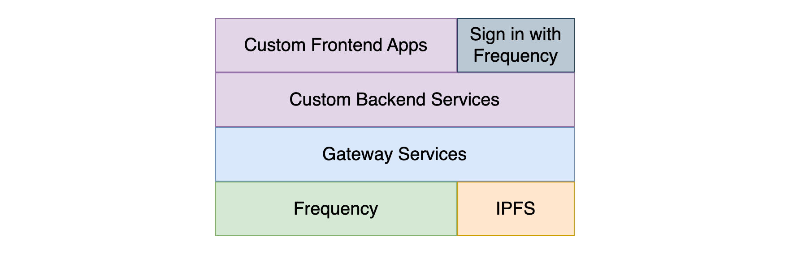

# Overview

Gateway is s set of microservices designed to make using DSNP over Frequency easy to use without needing to interact directly with the Frequency Node.

## Where to Start

  <a href="./Fundamentals/">Fundamentals</a>
  <a href="./GettingStarted/">Quick Start Tutorial</a>
  <a href="./Build/">Build</a>
  <a href="./Run/">Run</a>

## Basic Architecture

Gateway provides the basic structure

## Key Microservices

### Account Service

// TODO: Summary

### Graph Service

// TODO: Summary

### Content Publishing Service

// TODO: Summary

### Content Watcher Service

// TODO: Summary

## Benefits of Using Gateway

- Easy to use API without needing to worry about the complexty of web3
- Build DSNP/Frequency Applications faster
- Pick and choose your needed services
- TODO: More
