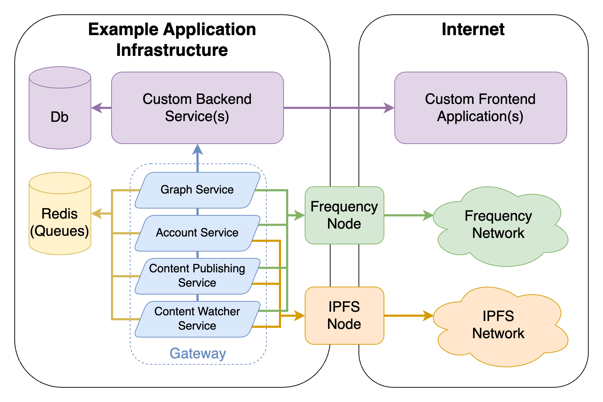

# Making Decentrialized Social Easy

Getting started building on Decentralized Social is as easy as deploying a Web2 API.

## Build What You Want

Gateway offers a suite of tools you can pick and choose from to build the best applications for your users.

<!-- Add more visual elements to the services -->

- Add decentralized authentication and onboarding workflows
- Connect your users with their universal social graph
- Read, write, and interact with social media content
- More coming...

## Web2 API Simplicity with Decentralized Power

- Build your applications faster
- Own your infrastructure
- OpenAPI/Swagger out of the box
- Optimized Docker images

## Basic Architecture

Gateway provides a simple API to interact with the Frequency social layers of identity, graph, content, and more.

These microservices are completely independent of one another, so you can use only those pieces you want or need.

## Key Microservices

### Account Service

The Account Service enables easy interaction with accounts on Frequency.
Accounts are defined as an `msaId` (64-bit identifier) and can contain additional information such as a handle, keys, and more.

- Account authentication and creation using [SIWF](https://github.com/ProjectLibertyLabs/siwf)
- Delegation management
- User Handle creation and retrieval
- User key retrieval and management

### Graph Service

The Graph Service enables easy interaction with social graphs on Frequency.
Each Graph connection on Frequency can be private or public and can be unidirectional (a follow) or bidiectional (double opt-in friend connection).

- Fetch user graph
- Update delegated user graphs
- Watch graphs for external updates

### Content Publishing Service

The Content Publishing Service enables the creation of new content-related activity on Frequency.

- Create posts to publicly broadcast
- Create replies to posts
- Create reactions to posts
- Create updates to existing content
- Request deletion of content
- Store and attach media with [IPFS](https://ipfs.tech)

### Content Watcher Service

The Content Watcher Service enables client applications to process content found on Frequency by registering for webhook notifications, triggered when relevant content is found, eleminating the need to interact with the chain for new content.

- Parses and validates Frequency content
- Filterable webhooks
- Scanning control

## Get Started

  <a href="./Fundamentals/">Fundamentals</a>
  <a href="./GettingStarted/">Quick Start Tutorial</a>
  <a href="./Build/">Build</a>
  <a href="./Run/">Run</a>

