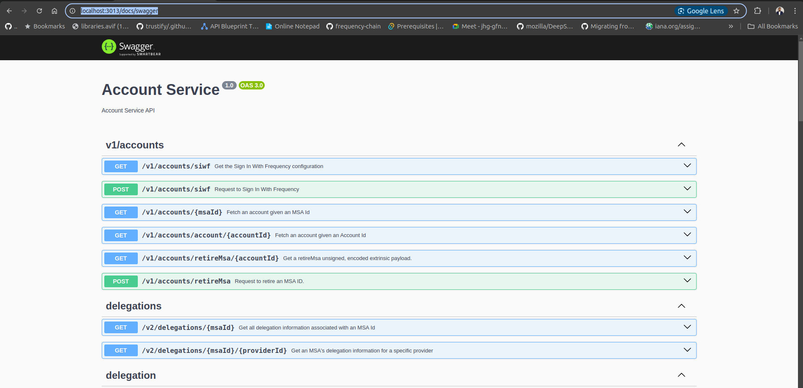

# Frequency Developer Gateway Kubernetes Deployment Guide

This guide will help you set up, configure, and test your Kubernetes services on Ubuntu using **MicroK8s** and **kubectl
**.

---

## **Table of Contents**

- [Frequency Developer Gateway Kubernetes Deployment Guide](#frequency-developer-gateway-kubernetes-deployment-guide)
    - [**Table of Contents**](#table-of-contents)
    - [Prerequisites](#prerequisites)
    - [1. Installing MicroK8s](#1-installing-microk8s)
    - [2. Setting Up MicroK8s](#2-setting-up-microk8s)
    - [3. Enable Kubernetes Add-ons in MicroK8s](#3-enable-kubernetes-add-ons-in-microk8s)
    - [4. (Optional) Installing `kubectl`](#4-optional-installing-kubectl)
    - [5. Deploying Frequency Developer Gateway](#5-deploying-frequency-developer-gateway)
        - [5.1. Prepare Helm Chart](#51-prepare-helm-chart)
        - [5.2. Deploy with Helm](#52-deploy-with-helm)
    - [6. Accessing Kubernetes Services](#6-accessing-kubernetes-services)
        - [6.1. Accessing via NodePort](#61-accessing-via-nodeport)
        - [6.2. Port-Forward for Local Testing](#62-port-forward-for-local-testing)
    - [7. Finding the Host Machine's IP Address](#7-finding-the-host-machines-ip-address)
    - [8. Verifying and Troubleshooting](#8-verifying-and-troubleshooting)
        - [Check Pods and Services](#check-pods-and-services)
        - [Inspect Pod Logs](#inspect-pod-logs)
        - [Checking Resources](#checking-resources)
    - [9. Tearing Down the Deployment](#9-tearing-down-the-deployment)
    - [10. Conclusion](#10-conclusion)

---

## Prerequisites

Before starting, ensure the following:

- **Ubuntu 20.04+**.
- [**MicroK8s**](https://microk8s.io/docs) installed and configured.
- [**Helm**](https://helm.sh/docs/intro/install/) installed for managing Kubernetes applications.
- [**kubectl**](https://kubernetes.io/docs/tasks/tools/install-kubectl/) installed for interacting with Kubernetes
  clusters. This is optional if you're using `microk8s kubectl`.
- [**Redis**](https://redis.io/docs/getting-started/installation/) installed and running.
- [**Frequency Chain**](https://docs.frequency.xyz/) running and accessible from the Kubernetes cluster.

Check this [guide](https://ubuntu.com/tutorials/install-a-local-kubernetes-with-microk8s#1-overview), for more details
on [installing MicroK8s](https://microk8s.io/docs) and [installing Helm](https://helm.sh/docs/intro/install/)

---

## 1. Installing MicroK8s

Install MicroK8s using the following command:

```bash
sudo snap install microk8s --classic --channel=1.28/stable
```

Once installed, verify the installation:

```bash
microk8s status --wait-ready
```

---

## 2. Setting Up MicroK8s

To manage MicroK8s as a regular user, you need to add your user to the `microk8s` group:

```bash
sudo usermod -aG microk8s $USER
sudo chown -f -R $USER ~/.kube
```

Then, apply the changes to the current session:

```bash
newgrp microk8s
```

Verify again:

```bash
microk8s status --wait-ready
```

---

## 3. Enable Kubernetes Add-ons in MicroK8s

To enhance your cluster functionality, you can enable the following MicroK8s add-ons:

```bash
sudo microk8s enable dns ingress storage helm3
```

- **DNS**: For service discovery.
- **Ingress**: To expose services externally.
- **Storage**: Dynamic storage provisioning.
- **Helm3**: Helm package manager for Kubernetes.

---

## 4. (Optional) Installing `kubectl`

If `kubectl` isn't already installed, you can use the following command to install it:

```bash
sudo snap install kubectl --classic
```

---

## 5. Deploying Frequency Developer Gateway

### 5.1. Prepare Helm Chart

An example Helm chart, for example, [
`frequency-gateway`](https://github.com/ProjectLibertyLabs/gateway/blob/main/deployment/k8s);

Make sure your `values.yaml` contains the correct configuration for NodePorts and services.

**Sample [
`values.yaml`](https://github.com/ProjectLibertyLabs/gateway/blob/main/deployment/k8s/frequency-gateway/values.yaml)
Excerpt:**

Things to consider:

- `FREQUENCY_URL` - URL of the Frequency Chain API
- `REDIS_URL` - URL of the Redis server
- `IPFS_ENDPOINT`: IPFS endpoint for pinning content
- `IPFS_GATEWAY_URL`: IPFS gateway URL for fetching content
- `PROVIDER_ACCOUNT_SEED_PHRASE` - Seed phrase or URI or Ethereum private key that is used for provider MSA control key
- `PROVIDER_ID` - MSA Id of the provider account

```yaml
service:
  type: NodePort
  account:
    port: 8080
    targetPort: http-account
    deploy: true <--- Set to true to deploy
  contentPublishing:
    port: 8081
    targetPort: http-publishing
    deploy: true
  contentWatcher:
    port: 8082
    targetPort: http-watcher
    deploy: true
  graph:
    port: 8083
    targetPort: http-graph
    deploy: true
```

---

### 5.2. Deploy with Helm

Deploy gateway with Helm:

```bash
sudo microk8s helm3 install frequency-gateway deployment/k8s/frequency-gateway/
```

Once deployed, verify that your Helm release is deployed:

```bash
sudo microk8s helm3 list
```

You should see the status as `deployed`.

---

## 6. Accessing Kubernetes Services

By default, Kubernetes services are exposed on `localhost`. Here's how to access them:

### 6.1. Accessing via NodePort

After deployment, check the NodePorts:

```bash
sudo microk8s kubectl get services
```

This will show output like:

```bash
frequency-gateway   NodePort    10.152.183.81   <none>        8080:31780/TCP,8081:30315/TCP,8082:31250/TCP,8083:31807/TCP   8s
```

The services are accessible via:

- **Port 8080**: `http://<node-ip>:31780`
- **Port 8081**: `http://<node-ip>:30315`
- **Port 8082**: `http://<node-ip>:31250`
- **Port 8083**: `http://<node-ip>:31807`

Note: `node-ip` is internal to the Kubernetes cluster. To access the services externally, you need to find the host
machine's IP address.

---

### 6.2. Port-Forward for Local Testing

If you just need to expose ports for local testing, you can use `kubectl port-forward`:

```bash
sudo microk8s kubectl port-forward svc/frequency-gateway 3013:8080 &
sudo microk8s kubectl port-forward svc/frequency-gateway 3014:8081 &
sudo microk8s kubectl port-forward svc/frequency-gateway 3015:8082 &
sudo microk8s kubectl port-forward svc/frequency-gateway 3016:8083 &
```

This will forward traffic from your localhost to the Kubernetes services.

Replace `<host-ip>` with the external IP of your host machine.

Access Swagger UI at `http://<host-ip>:3013/docs/swagger`



---

## 7. Finding the Host Machine's IP Address

If you need to access the services externally from another machine on the same network, you need the host machine's IP.

To find the IP address of the host:

```bash
hostname -I
```

This will return a list of IP addresses. Use the first IP (likely the local IP of your machine).

Example:

```bash
http://<host-ip>:8080
http://<host-ip>:8081
http://<host-ip>:8082
http://<host-ip>:8083
```

---

## 8. Verifying and Troubleshooting

### Check Pods and Services

```bash
sudo microk8s kubectl get pods
sudo microk8s kubectl get services
```

### Inspect Pod Logs

If any pods are not running as expected, you can check logs:

```bash
sudo microk8s kubectl logs <pod-name>
```

### Checking Resources

```bash
sudo microk8s kubectl describe pod <pod-name>
sudo microk8s kubectl describe service <service-name>
```

---

## 9. Tearing Down the Deployment

To delete the Helm release and clean up:

```bash
sudo microk8s helm3 uninstall frequency-gateway
```

Alternatively, to delete all Kubernetes resources:

```bash
sudo microk8s kubectl delete all --all
```

---

## 10. Conclusion

You've successfully deployed `Frequency Developer Gateway` on Kubernetes and Helm, exposing the services via NodePorts
for local access. You can also expand this setup by using Ingress for broader network access or by setting up a
cloud-based Kubernetes environment for production deployments.
