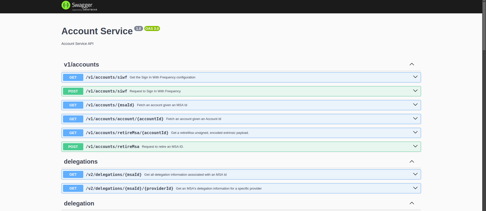

# Gateway Kubernetes Deployment Guide

This guide will help you set up, configure, and test your Kubernetes services on macOs using **Docker Desktop** and **kubectl**.

---

## **Table of Contents**

- [Gateway Kubernetes Deployment Guide](#gateway-kubernetes-deployment-guide)
  - [**Table of Contents**](#table-of-contents)
  - [Prerequisites](#prerequisites)
  - [1. Enable Kubernetes in Docker Desktop](#1-enable-kubernetes-in-docker-desktop)
  - [2. Setting Up MicroK8s](#2-setting-up-microk8s)
  - [3. Enable Kubernetes Add-ons in MicroK8s](#3-enable-kubernetes-add-ons-in-microk8s)
  - [4. (Optional) Installing `kubectl`](#4-optional-installing-kubectl)
  - [5. Deploying Frequency Gateway](#5-deploying-frequency-gateway)
    - [5.1. Prepare Helm Chart](#51-prepare-helm-chart)
    - [5.2. Deploy with Helm](#52-deploy-with-helm)
  - [6. Accessing Kubernetes Services](#6-accessing-kubernetes-services)
    - [6.1. Accessing via NodePort](#61-accessing-via-nodeport)
    - [6.2. Port-Forward for Local Testing](#62-port-forward-for-local-testing)
  - [7. Finding the Host Machine's IP Address](#7-finding-the-host-machines-ip-address)
  - [9. Verifying and Troubleshooting](#9-verifying-and-troubleshooting)
    - [Check Pods and Services](#check-pods-and-services)
    - [Inspect Pod Logs](#inspect-pod-logs)
    - [Checking Resources](#checking-resources)
  - [10. Tearing Down the Deployment](#10-tearing-down-the-deployment)
  - [Conclusion](#conclusion)

---

## Prerequisites

Before starting, ensure the following:

- **macOs Sequoia 15.0.1**
- **Docker Desktop** installed
- **Helm** installed
- **kubectl** command-line tool
- **Redis** installed and running
- **Frequency Chain** running

More information on [installing Docker Desktop](https://docs.docker.com/desktop/mac/install/).
More information on [installing Helm](https://helm.sh/docs/intro/install/).
More information on [installing kubectl](https://kubernetes.io/docs/tasks/tools/install-kubectl-macos/).
More information on [installing Redis](https://redis.io/download).

---

## 1. Enable Kubernetes in Docker Desktop

To enable Kubernetes in Docker Desktop:

1. Open Docker Desktop.
2. Go to **Settings**.
3. Select **Kubernetes**.
4. Check **Enable Kubernetes**.
5. Click **Apply & Restart**.

---

## 4. (Optional) Installing `kubectl`

If `kubectl` isn't already installed, you can use the following command to install it:

```bash
brew install kubectl
```

or

```bash
brew install kubernetes-cli
```

Test to ensure the version you installed is up-to-date:

```bash
kubectl version --client
```

---

## 5. Deploying Frequency Gateway

### 5.1. Prepare Helm Chart

An example Helm chart (for example, [`frequency-gateway`](/deployment/k8s/frequency-gateway/));

Make sure your `values.yaml` contains the correct configuration for NodePorts and services.

**Sample [`values.yaml`](/deployment/k8s/frequency-gateway/values.yaml) Excerpt:**

Things to consider:

- `FREQUENCY_URL` - URL of the Frequency Chain API
- `REDIS_URL` - URL of the Redis server
- `IPFS_ENDPOINT`: IPFS endpoint for pinning content
- `IPFS_GATEWAY_URL`: IPFS gateway URL for fetching content
- `PROVIDER_ACCOUNT_SEED_PHRASE` - Seed phrase for the provider account
- `PROVIDER_ID` - MSA ID of the provider account

```yaml
service:
  type: NodePort
  account:
    port: 8080
    targetPort: http-account
    deploy: true <--- Set to true to deploy
  contentPublishing:
    port: 8081
    targetPort: http-publishing
    deploy: true
  contentWatcher:
    port: 8082
    targetPort: http-watcher
    deploy: true
  graph:
    port: 8083
    targetPort: http-graph
    deploy: true
```

---

### 5.2. Deploy with Helm

Deploy gateway with Helm:

```bash
helm install frequency-gateway deployment/k8s/frequency-gateway/
```

Once deployed, verify that your Helm release is deployed:

```bash
helm list
```

You should see the status as `deployed`.

---

## 6. Accessing Kubernetes Services

By default, Kubernetes services are exposed on `localhost`. Here’s how to access them:

### 6.1. Accessing via NodePort

After deployment, check the NodePorts:

```bash
kubectl get services
```

This will show output like:

```bash
> kubectl get services
NAME                TYPE        CLUSTER-IP      EXTERNAL-IP   PORT(S)          AGE
frequency-gateway   NodePort    10.102.183.98   <none>        8080:30440/TCP   80s
kubernetes          ClusterIP   10.96.0.1       <none>        443/TCP          2m5s
```

The services are accessible via:

- **Port 8080**: `http://<node-ip>:31780`
- **Port 8081**: `http://<node-ip>:30315`
- **Port 8082**: `http://<node-ip>:31250`
- **Port 8083**: `http://<node-ip>:31807`

Note: `node-ip` is internal to the Kubernetes cluster. To access the services externally, you need to find the host machine's IP address.

---

### 6.2. Port-Forward for Local Testing

If you just need to expose ports for local testing, you can use `kubectl port-forward`:

```bash
sudo microk8s kubectl port-forward svc/frequency-gateway 3013:8080 &
sudo microk8s kubectl port-forward svc/frequency-gateway 3014:8081 &
sudo microk8s kubectl port-forward svc/frequency-gateway 3015:8082 &
sudo microk8s kubectl port-forward svc/frequency-gateway 3016:8083 &
```

This will forward traffic from your localhost to the Kubernetes services.

Replace `<host-ip>` with the external IP of your host machine.

Access Swagger UI at `http://<host-ip>:3013/docs/swagger`



---

## 7. Finding the Host Machine's IP Address

If you need to access the services externally from another machine on the same network, you need the host machine's IP.

To find the IP address of the host:

```bash
hostname -I
```

This will return a list of IP addresses. Use the first IP (likely the local IP of your machine).

Example:

```bash
http://<host-ip>:8080
http://<host-ip>:8081
http://<host-ip>:8082
http://<host-ip>:8083
```

---

## 9. Verifying and Troubleshooting

### Check Pods and Services

```bash
sudo microk8s kubectl get pods
sudo microk8s kubectl get services
```

### Inspect Pod Logs

If any pods are not running as expected, you can check logs:

```bash
sudo microk8s kubectl logs <pod-name>
```

### Checking Resources

```bash
sudo microk8s kubectl describe pod <pod-name>
sudo microk8s kubectl describe service <service-name>
```

---

## 10. Tearing Down the Deployment

To delete the Helm release and clean up:

```bash
sudo microk8s helm3 uninstall frequency-gateway
```

Alternatively, to delete all Kubernetes resources:

```bash
sudo microk8s kubectl delete all --all
```

---

## Conclusion

You've successfully deployed `Frequency Gateway` on Kubernetes and Helm, exposing the services via NodePorts for local access. You can also expand this setup by using Ingress for broader network access or by setting up a cloud-based Kubernetes environment for production deployments.
