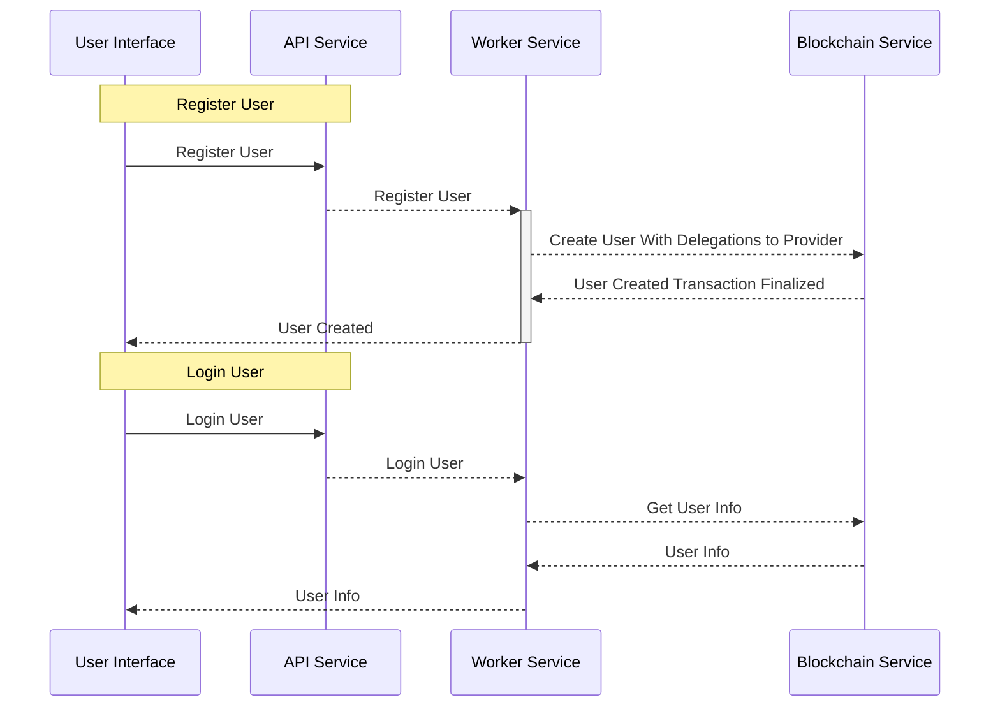
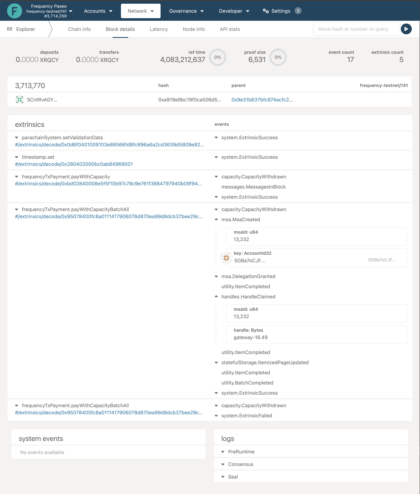
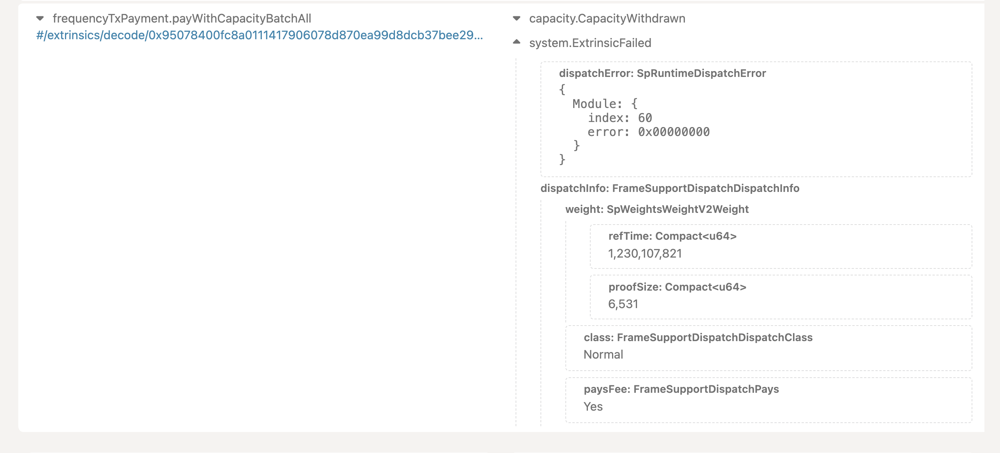
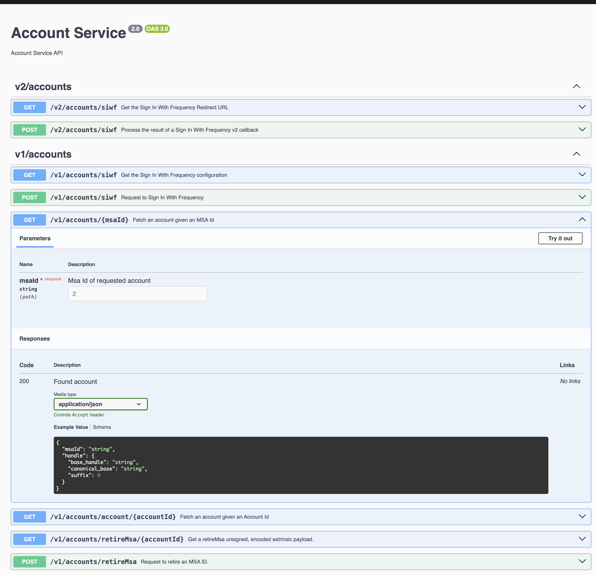
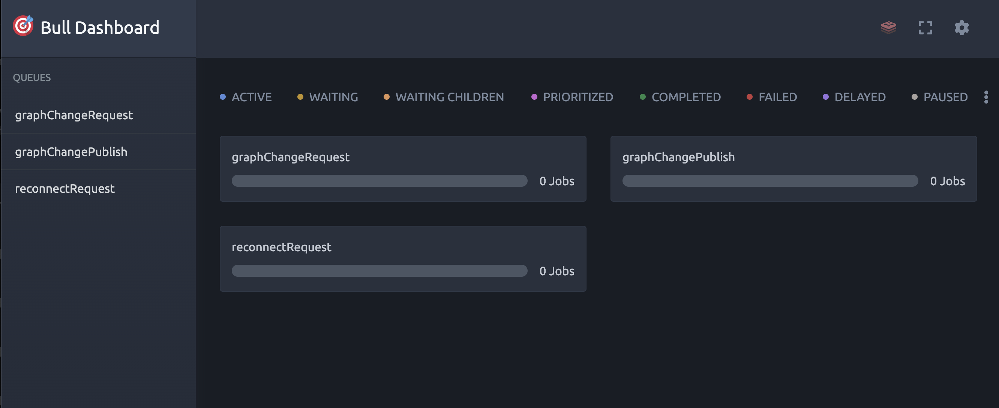

# Troubleshooting

So you set up your app or the [social-app-template](https://github.com/ProjectLibertyLabs/social-app-template), and your posts are not showing up. What next?

Here is a basic walk-through on figuring out where things went wrong.

We will examine the logs from the services configured for the default setup running against the Paseo Testnet. We will look at the flow of a post as it starts from the front end, gets published on-chain, and is displayed in a feed on the front end.

Some of these troubleshooting steps assume that the social-app-template is running your front end. If you have implemented your own front end, the Gateway service message flow will be similar.

## Registering Users

### Registration Process

Provider registration is required to setup a Provider on Frequency. This is a one-time process Providers use to register and obtain a Provider ID.  Registration of Providers on Testnet is unrestricted; on Mainnet it requires approval from the Frequency Network Foundation. See the [Provider Dashboard](https://provider.frequency.xyz) for more information.

The Register User flow is the process by which a user registers with a Provider.  This is a one-time process required each time a user signs up with a new Provider.  The user will be able to log in to the Provider's app using the Sign In With Frequency [SIWF](https://github.com/ProjectLibertyLabs/siwf) process.  The user will now be able to interact with the Provider's app.

The Login User flow is the process by which a user logs in to the Provider's app after the user has registered. The user will subsequently be able to interact with the Provider's app.

<!-- This diagram is excerpted from the original here: [Account Service Flow Chart](https://github.com/ProjectLibertyLabs/gateway/blob/main/developer-docs/account/account-service-flow.md). Please keep these diagrams in sync.-->


In debugging the user registration process using SIWF, we are mostly concerned with the Register User section of this diagram, and the flow of events through the Account Service.
The Account Service is composed of two main components: the API Service and the Worker Service.
The API Service handles incoming HTTP requests, while the Worker Service processes jobs that require blockchain interaction.

Here are the steps:

1. Provider’s application UI will invoke the Frequency Access UI, which collects the user's identity information and returns a signed registration payload. The Provider application then uses that information to send a registration request to the Gateway-Account Service API.
2. Account Service API receives the [SIWF POST](https://projectlibertylabs.github.io/gateway/account/#tag/v2accounts/operation/AccountsControllerV2_postSignInWithFrequency) at `/v2/accounts/swif` and enqueues a request to the Account Service Worker.
    - Account Service API will respond with a `200 OK` if enqueueing the request is successful.
3. Account Service Worker has been configured by the Provider to use Capacity to process the transactions and send them to the blockchain.
    - Account Service Worker will process the request and send a transaction to the blockchain.
    - Account Service Worker will monitor the blockchain for the transaction to be finalized.
4. The blockchain finalizes the transactions and Account Service Worker detects the finalized transaction. The Provider application may choose from several different methods to receive notification that the transaction has been finalized:
    - If a webhook configuration has been supplied, the Account Service Worker will send a webhook callback to the configured URL. The definition for the webhook endpoint can be found [here](https://projectlibertylabs.github.io/gateway/account/webhooks.html).
    - The application may also poll the Account Service API endpoint `GET /v1/accounts/account/{accountId}`; this endpoint will return an `HTTP 404 Not Found` error if the account has not been created on-chain yet.
(NOTE: Currently, the `social-app-template` frontend will poll the Account Service API (via the `social-app-template` backend) for 90 seconds to check if the user has been created. This is a temporary solution and it is recommended to use Server-Sent Events (SSE), or a similar method, to update the UI.)

What happens if I don't get the expected response?

## Behind the Scenes

### Logs from the Account Service API and Worker containers

Reference your DevOps team or the person who set up the Gateway Services environment for you to get access to the logs.
The logs will help you understand what is happening behind the scenes.
The logs will show you the requests that are coming in and the responses that are going out.

Here's a sample from the Account Service API running in Docker Desktop when a previously registered user logs in with SIWF.
The flow is similar to the registration process flow, but the user is already registered, so the Account Service Worker will not create a new user on the blockchain.

```log
# Timestamps have been removed for brevity
# Irrlevant logs have been removed for brevity
# Typical logs from a successful user login with SIWF
 DEBUG [AccountsControllerV1] Received request for Sign In With Frequency Configuration
 DEBUG [AccountsControllerV2] Received request for Sign In With Frequency v2 Redirect URL
 DEBUG [AccountsControllerV2] {"callbackUrl":"http://localhost:3001/login/callback","credentials":["VerifiedGraphKeyCredential","VerifiedEmailAddressCredential","VerifiedPhoneNumberCredential"],"permissions":["dsnp.profile@v1","dsnp.public-key-key-agreement@v1","dsnp.public-follows@v1","dsnp.private-follows@v1","dsnp.private-connections@v1"]}
 [...]
 DEBUG [AccountsControllerV2] Received request for Sign In With Frequency v2 Redirect URL
 DEBUG [AccountsControllerV2] {"callbackUrl":"http://localhost:3001/login/callback","credentials":["VerifiedGraphKeyCredential","VerifiedEmailAddressCredential","VerifiedPhoneNumberCredential"],"permissions":["dsnp.profile@v1","dsnp.public-key-key-agreement@v1","dsnp.public-follows@v1","dsnp.private-follows@v1","dsnp.private-connections@v1"]}
 [...]
 DEBUG [AccountsControllerV2] Received Sign In With Frequency v2 callback
 DEBUG [AccountsControllerV2] {"authorizationCode":"9d2739b6-4f71-44a2-b759-c8a7dd594fa6","authorizationPayload":null}
 [...]
 DEBUG [AccountsControllerV1] Received request to get account with msaId: 13224
 DEBUG [AccountsService] Found handle: gateway-15 for msaId: 13224
```

Here's a sample from the Account Service Worker running in Docker Desktop, when a user registers with SIWF.
Here, the Account Service Worker is processing the request and sending the transaction to the blockchain.

```bash
# Timestamps have been removed for brevity
# Irrlevant logs have been removed for brevity
# Typical logs from a successful user registration with SIWF, from the Account Service Worker
    LOG [TransactionPublisherService] Processing job 7lsjlxLT2ImiRLkwk8vaE-aWq8U of type Transaction Job - 7lsjlxLT2ImiRLkwk8vaE-aWq8U.
# [...]
# [Notes: `7lsjlxLT2ImiRLkwk8vaE-aWq8U` is the reference Id of the job that processes the blockchain transactions.
#          This value can be used to correlate the values returned from the webhook.]
# [...]
  DEBUG [BlockchainService] Capacity Wrapped Extrinsic: {"isSigned":false,"method":{"args":{"calls":[{"args":{"delegator_key":"5GBa7oCJFkTWMNLU8w43FSzhv66kR9kpHD5BecnG3Dyx2Dny","proof":{"Sr25519":"0xd4a57e2ac5e30ffa556e0abdb1b3678badfe77ee041a180ac0f9e5f254b1ab04ea9abf430102ba267f543552add7f7252304c3fab4c5b1377239c6cce4120485"},"add_provider_payload":{"authorizedMsaId":"729","schemaIds":["6","7","8","9","10"],"expiration":"3,713,859"}},"method":"createSponsoredAccountWithDelegation","section":"msa"},{"args":{"msa_owner_key":"5GBa7oCJFkTWMNLU8w43FSzhv66kR9kpHD5BecnG3Dyx2Dny","proof":{"Sr25519":"0x163a286a5ad2e27f7cbb16f9949a72952c1454cc49cfa8e919183ed94076622afbda6786d81ac874f4dc2ba9c5cc538b605afa59fe9b6fcf8d7a83363edf1f80"},"payload":{"baseHandle":"gateway-16","expiration":"3,713,859"}},"method":"claimHandle","section":"handles"},{"args":{"delegator_key":"5GBa7oCJFkTWMNLU8w43FSzhv66kR9kpHD5BecnG3Dyx2Dny","proof":{"Sr25519":"0xd678173c6508ffc4d0eeb4df95e8b1dd8282c8352adf4ef33b3012cd838818286f72edbaae7d5db64c423eafd51e748cadf82560ca4c755fd814a8648a21828a"},"payload":{"schemaId":"7","targetHash":"0","expiration":"3,713,859","actions":[{"Add":{"data":"0x405ba59e24e7ad28d791c92ed56c212d419a6ec699970b481f7dc40bc995e3bc1a"}}]}},"method":"applyItemActionsWithSignatureV2","section":"statefulStorage"}]},"method":"payWithCapacityBatchAll","section":"frequencyTxPayment"}}, nonce: 3586
# [...]
# [Notes: This log contains the encoded extrinsics that are sent to the blockchain.
#         You can look for the key extrinsics to correlate to your user registration:
#         - `createSponsoredAccountWithDelegation`
#         - `claimHandle`: The payload also includes the baseHandle that the user is claiming `gateway-16`
#         - `msa_owner_key`: The key of the user who is claiming the handle `5GBa7oCJFkTWMNLU8w43FSzhv66kR9kpHD5BecnG3Dyx2Dny`
# ]
# [...]
  DEBUG [BlockchainService] Tx hash: 0xdefab4526e86f83aecfea8df6620f1d7ac5c588000462926b2441cd44fac4228
  DEBUG [TransactionPublisherService] txns: {"signature":{"signer":{"id":"5C4hrfjw9DjXZTzV3MwzrrAr9P1MJhSrvWGWqi1eSuyUpnhM"},"signature":{"ed25519":"0x00000000000000000000000000000000000000000000000000000000000000000000000000000000000000000000000000000000000000000000000000000000"},"era":{"immortalEra":"0x00"},"nonce":0,"tip":0,"mode":0},"method":{"callIndex":"0x3c01","args":{"delegator_key":"5GBa7oCJFkTWMNLU8w43FSzhv66kR9kpHD5BecnG3Dyx2Dny","proof":{"sr25519":"0xd4a57e2ac5e30ffa556e0abdb1b3678badfe77ee041a180ac0f9e5f254b1ab04ea9abf430102ba267f543552add7f7252304c3fab4c5b1377239c6cce4120485"},"add_provider_payload":{"authorizedMsaId":729,"schemaIds":[6,7,8,9,10],"expiration":3713859}}}},{"signature":{"signer":{"id":"5C4hrfjw9DjXZTzV3MwzrrAr9P1MJhSrvWGWqi1eSuyUpnhM"},"signature":{"ed25519":"0x00000000000000000000000000000000000000000000000000000000000000000000000000000000000000000000000000000000000000000000000000000000"},"era":{"immortalEra":"0x00"},"nonce":0,"tip":0,"mode":0},"method":{"callIndex":"0x4200","args":{"msa_owner_key":"5GBa7oCJFkTWMNLU8w43FSzhv66kR9kpHD5BecnG3Dyx2Dny","proof":{"sr25519":"0x163a286a5ad2e27f7cbb16f9949a72952c1454cc49cfa8e919183ed94076622afbda6786d81ac874f4dc2ba9c5cc538b605afa59fe9b6fcf8d7a83363edf1f80"},"payload":{"baseHandle":"0x676174657761792d3136","expiration":3713859}}}},{"signature":{"signer":{"id":"5C4hrfjw9DjXZTzV3MwzrrAr9P1MJhSrvWGWqi1eSuyUpnhM"},"signature":{"ed25519":"0x00000000000000000000000000000000000000000000000000000000000000000000000000000000000000000000000000000000000000000000000000000000"},"era":{"immortalEra":"0x00"},"nonce":0,"tip":0,"mode":0},"method":{"callIndex":"0x3f06","args":{"delegator_key":"5GBa7oCJFkTWMNLU8w43FSzhv66kR9kpHD5BecnG3Dyx2Dny","proof":{"sr25519":"0xd678173c6508ffc4d0eeb4df95e8b1dd8282c8352adf4ef33b3012cd838818286f72edbaae7d5db64c423eafd51e748cadf82560ca4c755fd814a8648a21828a"},"payload":{"schemaId":7,"targetHash":0,"expiration":3713859,"actions":[{"add":{"data":"0x405ba59e24e7ad28d791c92ed56c212d419a6ec699970b481f7dc40bc995e3bc1a"}}]}}}}
# [...]
# [Notes: This log contains the encoded extrinsics that are sent to the blockchain.
#         You can look for the key extrinsics to correlate to your user registration:
#         - There is some additional information in this log about the Provider.
#         - `authorizedMsaId`: The MSA ID of the Provider that the user is registering with `729`
#         - `schemaIds`: The schema IDs that the user is registering with `[6,7,8,9,10]`
#         The following logs show the details of the transactions that were sent to the blockchain.]
# [...]
  DEBUG [TransactionPublisherService] Successful job: {
"name": "Transaction Job - 7lsjlxLT2ImiRLkwk8vaE-aWq8U",
"data": {
  "calls": [
    {
      "pallet": "msa",
      "extrinsicName": "createSponsoredAccountWithDelegation",
      "encodedExtrinsic": "0xed01043c01b62d996b7c3733ce2ace8c0abac4c8e461bdb54e59fd211013133e8381129e4d01d4a57e2ac5e30ffa556e0abdb1b3678badfe77ee041a180ac0f9e5f254b1ab04ea9abf430102ba267f543552add7f7252304c3fab4c5b1377239c6cce4120485d9020000000000001406000700080009000a0043ab3800"
    },
    {
      "pallet": "handles",
      "extrinsicName": "claimHandle",
      "encodedExtrinsic": "0xcd01044200b62d996b7c3733ce2ace8c0abac4c8e461bdb54e59fd211013133e8381129e4d01163a286a5ad2e27f7cbb16f9949a72952c1454cc49cfa8e919183ed94076622afbda6786d81ac874f4dc2ba9c5cc538b605afa59fe9b6fcf8d7a83363edf1f8028676174657761792d313643ab3800"
    },
    {
      "pallet": "statefulStorage",
      "extrinsicName": "applyItemActionsWithSignatureV2",
      "encodedExtrinsic": "0x3902043f06b62d996b7c3733ce2ace8c0abac4c8e461bdb54e59fd211013133e8381129e4d01d678173c6508ffc4d0eeb4df95e8b1dd8282c8352adf4ef33b3012cd838818286f72edbaae7d5db64c423eafd51e748cadf82560ca4c755fd814a8648a21828a1c0043ab3800040084405ba59e24e7ad28d791c92ed56c212d419a6ec699970b481f7dc40bc995e3bc1a"
    }
  ],
  "type": "SIWF_SIGNUP",
  "providerId": "729",
  "referenceId": "7lsjlxLT2ImiRLkwk8vaE-aWq8U"
},
"opts": {
  "attempts": 1,
  "jobId": "7lsjlxLT2ImiRLkwk8vaE-aWq8U",
  "removeOnComplete": 20,
  "removeOnFail": false
},
"id": "7lsjlxLT2ImiRLkwk8vaE-aWq8U",
"progress": 0,
"returnvalue": null,
"stacktrace": [],
"delay": 0,
"priority": 0,
"attemptsStarted": 1,
"attemptsMade": 0,
"timestamp": 1741987028042,
"queueQualifiedName": "account::bull:transactionPublish",
"processedOn": 1741987028046,
"token": "a466f600-1661-46b3-9643-24d2c13d5f88:1268"
}
[...]
  DEBUG [BlockchainService] Capacity Wrapped Extrinsic: {"isSigned":false,"method":{"args":{"calls":[{"args":{"delegator_key":"5GBa7oCJFkTWMNLU8w43FSzhv66kR9kpHD5BecnG3Dyx2Dny","proof":{"Sr25519":"0xa87b75a1acf83c22445c953f3ef9982e9d79301a9e28641a3f7b9377d4f7b321964712667595147c4af5882ff5d6d1fba3c3ed0a5ff4144516a2b52aeb0d448d"},"add_provider_payload":{"authorizedMsaId":"729","schemaIds":["6","7","8","9","10"],"expiration":"3,713,859"}},"method":"createSponsoredAccountWithDelegation","section":"msa"},{"args":{"msa_owner_key":"5GBa7oCJFkTWMNLU8w43FSzhv66kR9kpHD5BecnG3Dyx2Dny","proof":{"Sr25519":"0x9e7475ca8254cebd47729ea398855a4e58b513c3096018957589f0febe97047013c5714751296a6da438804a8836a72428e921078fab3ba103cb68a3f32fad85"},"payload":{"baseHandle":"gateway-16","expiration":"3,713,859"}},"method":"claimHandle","section":"handles"},{"args":{"delegator_key":"5GBa7oCJFkTWMNLU8w43FSzhv66kR9kpHD5BecnG3Dyx2Dny","proof":{"Sr25519":"0xec10a05dc11d5ffc358abb0bd7fd6ed3bbcfa18df0c3dee751baf9102d5dfa26e5af656ba217a3d8df7484f8db85b01031a88719b5849b1ecfc55913baf81486"},"payload":{"schemaId":"7","targetHash":"0","expiration":"3,713,859","actions":[{"Add":{"data":"0x405ba59e24e7ad28d791c92ed56c212d419a6ec699970b481f7dc40bc995e3bc1a"}}]}},"method":"applyItemActionsWithSignatureV2","section":"statefulStorage"}]},"method":"payWithCapacityBatchAll","section":"frequencyTxPayment"}}, nonce: 3587
  DEBUG [BlockchainService] Tx hash: 0x9c26af8ddc8f371d226b55d6df1f5d90bcb0ecf754c639d818add41caf6b0270
  DEBUG [TransactionPublisherService] txns: {"signature":{"signer":{"id":"5C4hrfjw9DjXZTzV3MwzrrAr9P1MJhSrvWGWqi1eSuyUpnhM"},"signature":{"ed25519":"0x00000000000000000000000000000000000000000000000000000000000000000000000000000000000000000000000000000000000000000000000000000000"},"era":{"immortalEra":"0x00"},"nonce":0,"tip":0,"mode":0},"method":{"callIndex":"0x3c01","args":{"delegator_key":"5GBa7oCJFkTWMNLU8w43FSzhv66kR9kpHD5BecnG3Dyx2Dny","proof":{"sr25519":"0xa87b75a1acf83c22445c953f3ef9982e9d79301a9e28641a3f7b9377d4f7b321964712667595147c4af5882ff5d6d1fba3c3ed0a5ff4144516a2b52aeb0d448d"},"add_provider_payload":{"authorizedMsaId":729,"schemaIds":[6,7,8,9,10],"expiration":3713859}}}},{"signature":{"signer":{"id":"5C4hrfjw9DjXZTzV3MwzrrAr9P1MJhSrvWGWqi1eSuyUpnhM"},"signature":{"ed25519":"0x00000000000000000000000000000000000000000000000000000000000000000000000000000000000000000000000000000000000000000000000000000000"},"era":{"immortalEra":"0x00"},"nonce":0,"tip":0,"mode":0},"method":{"callIndex":"0x4200","args":{"msa_owner_key":"5GBa7oCJFkTWMNLU8w43FSzhv66kR9kpHD5BecnG3Dyx2Dny","proof":{"sr25519":"0x9e7475ca8254cebd47729ea398855a4e58b513c3096018957589f0febe97047013c5714751296a6da438804a8836a72428e921078fab3ba103cb68a3f32fad85"},"payload":{"baseHandle":"0x676174657761792d3136","expiration":3713859}}}},{"signature":{"signer":{"id":"5C4hrfjw9DjXZTzV3MwzrrAr9P1MJhSrvWGWqi1eSuyUpnhM"},"signature":{"ed25519":"0x00000000000000000000000000000000000000000000000000000000000000000000000000000000000000000000000000000000000000000000000000000000"},"era":{"immortalEra":"0x00"},"nonce":0,"tip":0,"mode":0},"method":{"callIndex":"0x3f06","args":{"delegator_key":"5GBa7oCJFkTWMNLU8w43FSzhv66kR9kpHD5BecnG3Dyx2Dny","proof":{"sr25519":"0xec10a05dc11d5ffc358abb0bd7fd6ed3bbcfa18df0c3dee751baf9102d5dfa26e5af656ba217a3d8df7484f8db85b01031a88719b5849b1ecfc55913baf81486"},"payload":{"schemaId":7,"targetHash":0,"expiration":3713859,"actions":[{"add":{"data":"0x405ba59e24e7ad28d791c92ed56c212d419a6ec699970b481f7dc40bc995e3bc1a"}}]}}}}
  DEBUG [TransactionPublisherService] Successful job: {
  "name": "Transaction Job - nrAExB2vCxASFDcfDbYF5QEXV_0",
  "data": {
    "calls": [
      {
        "pallet": "msa",
        "extrinsicName": "createSponsoredAccountWithDelegation",
        "encodedExtrinsic": "0xed01043c01b62d996b7c3733ce2ace8c0abac4c8e461bdb54e59fd211013133e8381129e4d01a87b75a1acf83c22445c953f3ef9982e9d79301a9e28641a3f7b9377d4f7b321964712667595147c4af5882ff5d6d1fba3c3ed0a5ff4144516a2b52aeb0d448dd9020000000000001406000700080009000a0043ab3800"
      },
      {
        "pallet": "handles",
        "extrinsicName": "claimHandle",
        "encodedExtrinsic": "0xcd01044200b62d996b7c3733ce2ace8c0abac4c8e461bdb54e59fd211013133e8381129e4d019e7475ca8254cebd47729ea398855a4e58b513c3096018957589f0febe97047013c5714751296a6da438804a8836a72428e921078fab3ba103cb68a3f32fad8528676174657761792d313643ab3800"
      },
      {
        "pallet": "statefulStorage",
        "extrinsicName": "applyItemActionsWithSignatureV2",
        "encodedExtrinsic": "0x3902043f06b62d996b7c3733ce2ace8c0abac4c8e461bdb54e59fd211013133e8381129e4d01ec10a05dc11d5ffc358abb0bd7fd6ed3bbcfa18df0c3dee751baf9102d5dfa26e5af656ba217a3d8df7484f8db85b01031a88719b5849b1ecfc55913baf814861c0043ab3800040084405ba59e24e7ad28d791c92ed56c212d419a6ec699970b481f7dc40bc995e3bc1a"
      }
    ],
    "type": "SIWF_SIGNUP",
    "providerId": "729",
    "referenceId": "nrAExB2vCxASFDcfDbYF5QEXV_0"
  },
  "opts": {
    "attempts": 1,
    "jobId": "nrAExB2vCxASFDcfDbYF5QEXV_0",
    "removeOnComplete": 20,
    "removeOnFail": false
  },
  "id": "nrAExB2vCxASFDcfDbYF5QEXV_0",
  "progress": 0,
  "returnvalue": null,
  "stacktrace": [],
  "delay": 0,
  "priority": 0,
  "attemptsStarted": 1,
  "attemptsMade": 0,
  "timestamp": 1741987028046,
  "queueQualifiedName": "account::bull:transactionPublish",
  "processedOn": 1741987029051,
  "token": "a466f600-1661-46b3-9643-24d2c13d5f88:1268"
}
VERBOSE [TxnNotifierService] Successfully found transaction 0xdefab4526e86f83aecfea8df6620f1d7ac5c588000462926b2441cd44fac4228 in block 3713770
    LOG [TxnNotifierService] SIWF: 5GBa7oCJFkTWMNLU8w43FSzhv66kR9kpHD5BecnG3Dyx2Dny Signed up handle gateway-16.49 for msaId 13232 delegated to provider 729.
# [...]
# [Notes: The above logs contains the transaction hash, block number,
#         and SIWF informaion that was sent to the blockchain.
#         You can use this hash to look up the transaction on the blockchain explorer.
#         The following logs show the Account Service Worker sending a webhook callback to the Provider,
#         this should match your webhook URL that you configured for the Gateway Account Service.]
# [...]
  DEBUG [TxnNotifierService] Sending transaction notification to webhook: http://mock-webhook-logger:3001/webhooks/account-service
  DEBUG [TxnNotifierService] Transaction: {"transactionType":"SIWF_SIGNUP","providerId":"729","referenceId":"7lsjlxLT2ImiRLkwk8vaE-aWq8U","msaId":"13232","accountId":"5GBa7oCJFkTWMNLU8w43FSzhv66kR9kpHD5BecnG3Dyx2Dny","handle":"gateway-16.49"}
```

#### When Things Go Wrong

Look in these logs for any errors or warnings. If you see any, they will give you a clue as to what went wrong.

Find the block number that corresponds with the error in the log, and then use that block number to look up the transaction on the [Polkadot blockchain explorer](https://polkadot.js.org/apps/?rpc=wss%3A%2F%2F0.rpc.testnet.amplica.io#/explorer).
This will give you more information about the transaction and the error that occurred.

<!-- {{#png-embed ./src/PolkadotBlockExplorer.png Polkadot Block Explorer}} -->


In the above image you will able to see the transactions in that block.

**NOTE:** If you are on a public chain (ie, Testnet or mainnet), you may not be the only contributor of transactions to that block.
Anybody can be posting to that block.  However, you should be able to find the transaction within that block by

 1) Mapping to the correct extrinsics (msa.msaCreated, msa.DelegationGranted, msa.HandleClaimed and statefulStorage.ItemizedPageUpdated)
 2) Finding the transaction that maps to your provider MSA (729 in the example above)
 3) Checking the User Key `(5GBa7oCJF…` in the example below)
 4) Checking the user handle provided to you against the one claimed in the transaction (gateway-16.49 in the example below)

You may get a message that the extrinsic failed.
In this case, there will be an error code you can reference.
In the below example, the error index is 60 and the error code is 0. Error index indicates the Frequency Substrate pallet that produced the error, and the error code is the value of the error enum within that pallet. A list of errors can be found in [the Frequency Wiki](https://github.com/frequency-chain/frequency/wiki/Errors).



### Validate Your Deployment

Confirm that Frequency Developer Gateway Services are properly deployed and running. This guide provides examples for using [Docker Swarm](https://projectlibertylabs.github.io/gateway/Run/Deployment.html#part-1-deploying-with-docker-swarm) and [Kubernetes](https://projectlibertylabs.github.io/gateway/Run/Kubernetes.html) in AWS. However, the same principles apply to other deployment methods.

#### Validate Your Services

Gateway depends on a number of [standard services](https://projectlibertylabs.github.io/gateway/Fundamentals/Architecture.html?highlight=Redis#standard-services-gateway-uses) including Redis, BullMQ and IPFS Kubo API.  Each of these services must be correctly configured and deployed within your development environment in order for Gateway to function properly.  As part of this process, you may also wish to double check your [environment variables](https://github.com/ProjectLibertyLabs/gateway/blob/main/developer-docs/account/ENVIRONMENT.md).

#### Validating Your IPFS Environment

1. Ensure your [IPFS node](https://projectlibertylabs.github.io/gateway/Run/IPFS.html) is running correctly and check the status of your IPFS node.
2. For additional management tasks and tests refer to the [IPFS Documentation](https://docs.ipfs.io).

#### Validating Your Redis and BullMQ Environment

1. Inspect all of your container logs, not just the ones pertaining to the API Service.  (Any one of your logs may show a problem with Redis.)  Look for error messages in your logs, specifically related to BullMQ or Redis.
2. Try to execute a command shell in the container that your service is running in and invoke the Redis command line or ping the Redis node in order to verify your application container has network connectivity to your Redis environment.
3. Further configuration information may be found in the [environment files](https://github.com/ProjectLibertyLabs/gateway/blob/main/env-files/account.template.env#L36).
4. If either of these tests fail, you will need to first correct the problems in the Redis environment before you can move forward with Gateway.

#### Swagger/OpenAPI Documentation

Each Gateway service provides a Swagger/OpenAPI interface that you can use to test API endpoints directly.

If you're using a deployed environment, consult your DevOps team or the person who set up the Gateway Services to get the appropriate access information. You'll need to replace `localhost:[PORT]` with the correct host and port for your deployment.

For local development environments, the Swagger UI is available at these URLs:

```bash
┌──────────────────────────────────────────────────────────────────────────────────────────────┐
│ 🔗💠📡                                                                                        │
│ 🔗💠📡      * account-service:                                                                │
│ 🔗💠📡          - Swagger UI:       http://localhost:3013/docs/swagger                        │
│ 🔗💠📡                                                                                        │
│ 🔗💠📡      * content-publishing-service:                                                     │
│ 🔗💠📡          - Swagger UI:       http://localhost:3010/docs/swagger                        │
│ 🔗💠📡                                                                                        │
│ 🔗💠📡      * content-watcher-service:                                                        │
│ 🔗💠📡          - Swagger UI:       http://localhost:3011/docs/swagger                        │
│ 🔗💠📡                                                                                        │
│ 🔗💠📡      * graph-service:                                                                  │
│ 🔗💠📡          - Swagger UI:       http://localhost:3012/docs/swagger                        │
│ 🔗💠📡                                                                                        │
└──────────────────────────────────────────────────────────────────────────────────────────────┘
```

<!-- Briefly explain how to use the Swagger UI to test the API endpoints. -->
1. Open the Swagger UI in your web browser.
2. You will see a list of available API endpoints.
3. Click on an endpoint to expand it and see the details.
4. You can fill in the required parameters and click "Try it out!" to test the endpoint.
5. The Swagger UI will show you the request and response details, including any errors that occurred.
<!-- Embed the Swagger UI image -->


#### BullMQ UI Documentation

The BullMQ UI is a web interface that allows you to monitor the queues and jobs in the Gateway services. You can use it to see the status of jobs, retry failed jobs, and view job logs.

If you're using a deployed environment, consult your DevOps team or the person who set up the Gateway Services to get the appropriate access information. You'll need to replace `localhost:[PORT]` with the correct host and port for your deployment.

For local development environments, the BullMQ UI is available at these URLs:

```bash
┌──────────────────────────────────────────────────────────────────────────────────────────────┐
│ 🔗💠📡                                                                                        │
│ 🔗💠📡      * account-service:                                                                │
│ 🔗💠📡          - Queue management: http://localhost:3013/queues                              │
│ 🔗💠📡                                                                                        │
│ 🔗💠📡      * content-publishing-service:                                                     │
│ 🔗💠📡          - Queue management: http://localhost:3010/queues                              │
│ 🔗💠📡                                                                                        │
│ 🔗💠📡      * content-watcher-service:                                                        │
│ 🔗💠📡          - Queue management: http://localhost:3011/queues                              │
│ 🔗💠📡                                                                                        │
│ 🔗💠📡      * graph-service:                                                                  │
│ 🔗💠📡          - Queue management: http://localhost:3012/queues                              │
│ 🔗💠📡                                                                                        │
└──────────────────────────────────────────────────────────────────────────────────────────────┘
```
<!-- Briefly explain how to access and use the BullMQ UI to monitor the queues. -->
1. Open the BullMQ UI in your web browser.
2. You will see a list of queues and jobs.
3. Click on a queue to see the details of the jobs in that queue.
4. You can view the status of jobs, retry failed jobs, and view job logs.
5. You can also see the job progress and any errors that occurred.
<!-- Embed the BullMQ UI image -->

