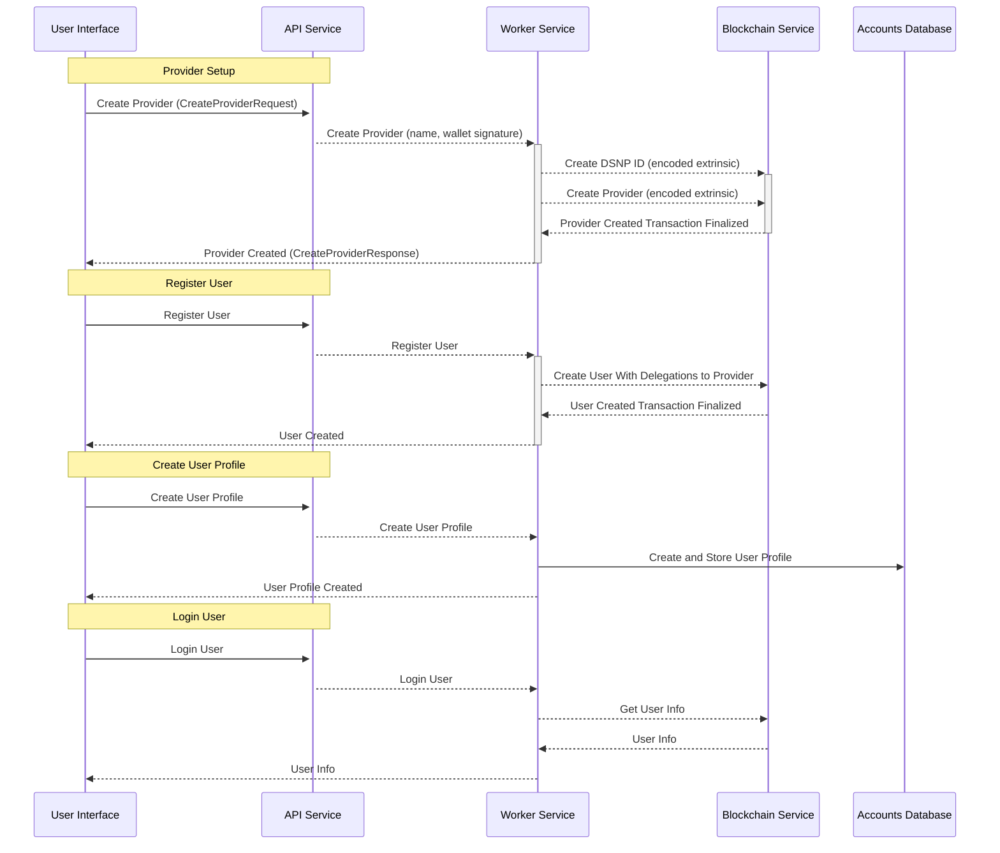

# Account Service Flow Chart

```mermaid
sequenceDiagram
    participant UI as User Interface
    participant API as API Service
    participant WS as Worker Service
    participant BL as Blockchain Service
    participant DB as Accounts Database

    # Setup Provider
    Note over UI, API: Provider Setup
    UI->>+API: Create Provider (CreateProviderRequest)
    API-->>+WS: Create Provider (name, wallet signature)
    WS-->>+BL: Create DSNP ID (encoded extrinsic)
    WS-->>BL: Create Provider (encoded extrinsic)
    BL-->>-WS: Provider Created Transaction Finalized
    WS-->>-UI: Provider Created (CreateProviderResponse)

    # Register User
    Note over UI, API: Register User
    UI->>API: Register User
    API-->>+WS: Register User
    WS-->>BL: Create User With Delegations to Provider
    BL-->>WS: User Created Transaction Finalized
    WS-->>-UI: User Created

    # Create User Profile
    Note over UI, API: Create User Profile
    UI->>API: Create User Profile
    API-->>WS: Create User Profile
    WS->>DB: Create and Store User Profile
    WS-->>UI: User Profile Created

    # Get User Profile

    # Login User
    Note over UI, API: Login User
    UI->>API: Login User
    API-->>WS: Login User
    WS-->>BL: Get User Info
    BL-->>WS: User Info
    WS-->>UI: User Info

    # UI->>AR: Register
    # AR-->>UI: Success
    # UI->>AL: Login
    # AL-->>UI: Success
    # UI->>AG: Get User Info
    # AG-->>UI: Success -->
```
