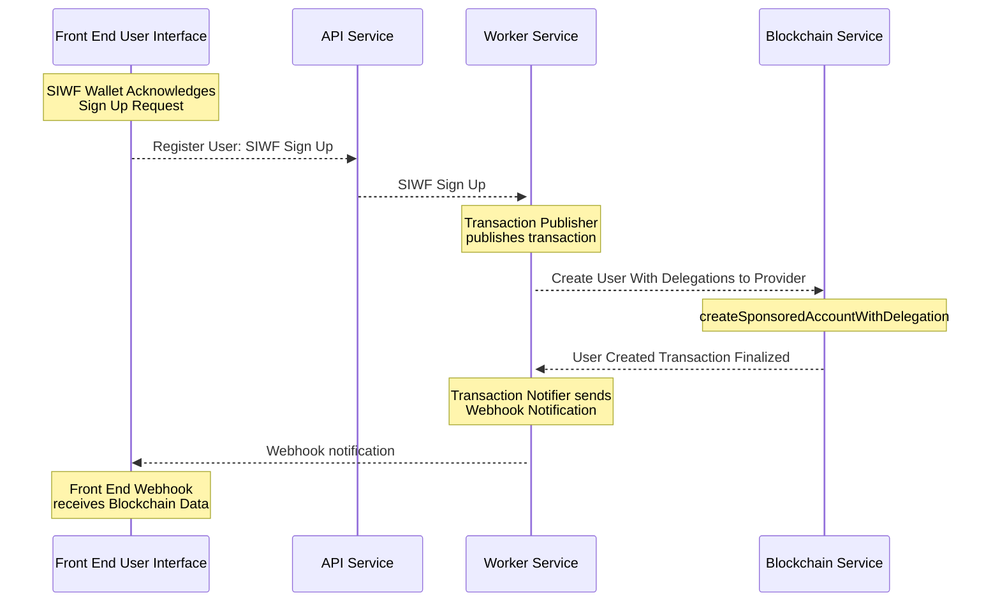

# New SIWF Sign Up Flow Chart

```mermaid
sequenceDiagram
    participant UI as Front End User Interface
    participant API as API Service
    participant WS as Worker Service
    participant BL as Blockchain Service

    # Register User with SIWF
    Note over UI: SIWF Wallet Acknowledges<br>Sign Up Request
    UI-->>API: Register User: SIWF Sign Up
    API-->>+WS: SIWF Sign Up
    Note over WS: Transaction Publisher<br>publishes transaction
    WS-->>BL: Create User With Delegations to Provider
    Note over BL: createSponsoredAccountWithDelegation
    BL-->>WS: User Created Transaction Finalized
    Note over WS:  Transaction Notifier sends<br>Webhook Notification
    WS-->>UI: Webhook notification
    Note over UI: Front End Webhook<br>receives Blockchain Data
```
