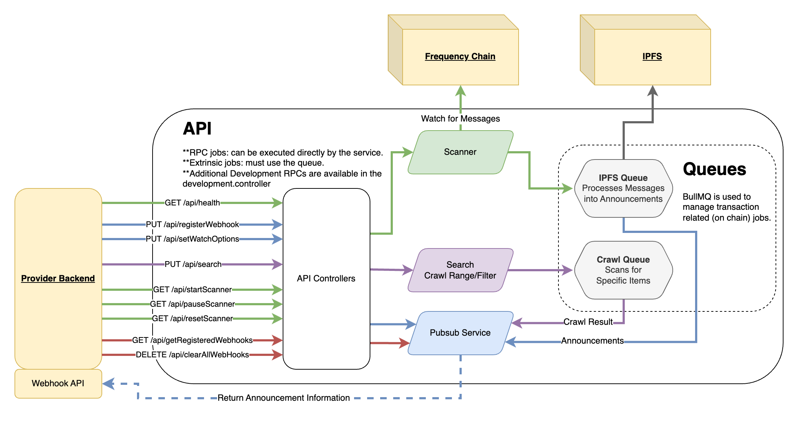

# Content Watcher

<!-- TABLE OF CONTENTS -->

# 📗 Table of Contents

- [📖 About the Project](#about-project)
- [🔍 Arch Map](#-arch-maps)
- [🛠 Built With](#-built-with)
  - [Tech Stack](#tech-stack)
  - [Key Features](#key-features)
- [🚀 Live OpenAPI Docs](#-live-docs)
- [💻 Getting Started](#-getting-started)
  - [Prerequisites](#prerequisites)
  - [Environment Variables](#environment-variables)
  - [Setup](#setup)
  - [Install](#install)
  - [Usage](#usage)
  - [Swagger](#swagger-ui)
  - [Queue Management](#queue-management)
  - [Run tests](#run-tests)
  - [Linting](#linting)
  - [Formatting](#auto-format)
- [🤝 Contributing](#-contributing)
- [⭐️ Show your support](#-support)
- [🙏 Acknowledgements](#-acknowledgements)
- [❓FAQ](#faq)
- [📝 License](#-license)

<!-- PROJECT DESCRIPTION -->

# 📖 Content Watcher Service <a name="about-project"></a>

The Content Watcher Service is part of the "Social Gateway" collection of services that provides a familiar callback API to retrieve content and publishing announcements from the Frequency chain. The service handles all of the necessary blockchain interaction and allows clients to interact using a familiar, web2-friendly interface.

<!-- Arch maps -->

## 🔭 Arch Maps

The Content Watcher Service provides a webhook system for receiving notice of new content.
Even with a crawl request, the results are not retreived, but pushed to the webhook.



<p align="right">(<a href="#-table-of-contents">back to top</a>)</p>

## 🛠 Built With <a name="built-with"></a>

### Tech Stack <a name="tech-stack"></a>

<details>
  <summary>Server</summary>
  <ul>
    <li><a href="https://nestjs.com/">NestJS</a></li>
    <li><a href="https://nodejs.org/">Node.js</a></li>
    <li><a href="https://www.typescriptlang.org/">TypeScript</a></li>
  </ul>
</details>

<details>
  <summary>Data store</summary>
  <ul>
    <li><a href="https://redis.io/">Redis (ioredis)</a></li>
  </ul>
</details>

<details>
  <summary>Frameworks and Libraries</summary>
  <ul>
    <li><a href="https://docs.nestjs.com/techniques/queues">BullMQ (NestJS BullMQ Integration)</a></li>
    <li><a href="https://github.com/hapijs/joi">Joi</a></li>
    <li><a href="https://axios-http.com/">Axios</a></li>
  </ul>
</details>

<details>
  <summary>Polkadot and DSNP Integration</summary>
  <ul>
    <li><a href="https://polkadot.js.org/">Polkadot API (@polkadot/api)</a></li>
    <li><a href="https://github.com/LibertyDSNP/spec">DSNP (Activity Content, Frequency Schemas, ParquetJS)</a></li>
  </ul>
</details>

<details>
  <summary>Testing</summary>
  <ul>
    <li><a href="https://jestjs.io/">Jest</a>
        <ul>
          <li><a href="https://kulshekhar.github.io/ts-jest/">ts-jest</a></li>
          <li><a href="https://github.com/visionmedia/supertest">Supertest</a></li>
          <li><a href="https://github.com/stipsan/ioredis-mock">ioredis-mock</a></li>
        </ul>
      </li>
  </ul>
</details>

<details>
  <summary>Formatting</summary>
  <ul>
    <li><a href="https://prettier.io/">Prettier</a></li>
    <li><a href="https://typescript-eslint.io/">TypeScript ESLint</a></li>
  </ul>
</details>

<details>
  <summary>Build and Deployment</summary>
  <ul>
    <li><a href="https://github.com/motdotla/dotenv">Dotenv</a></li>
    <li><a href="https://www.docker.com/">Docker</a></li>
    <li><a href="https://docs.docker.com/compose/">Docker Compose</a></li>
    <li><a href="https://docs.nestjs.com/cli/overview">Nest CLI</a></li>
  </ul>
</details>

<!-- Features -->

### Key Features

#### API
- **Parse DSNP Messages on Frequency**
- **Send content to registered webhooks**
- **Simple Schema and MSA Id based filtering**

#### Scanner API
- **Start, Stop, and restart scanning**

<p align="right">(<a href="#-table-of-contents">back to top</a>)</p>

<!-- LIVE Docs -->

## 🚀 Live Docs

- [Live Docs](https://amplicalabs.github.io/content-watcher-service/)
- [API Documentation](https://amplicalabs.github.io/content-watcher-service/)
- [GitHub](https://github.com/AmplicaLabs/content-watcher-service)

<p align="right">(<a href="#-table-of-contents">back to top</a>)</p>

<!-- GETTING STARTED -->

## 💻 Getting Started

This guide is tailored for developers working in the code base for the Content Watcher Service itself. For a more tutorial tailored more for developers wanting to deploy the Content Watcher Service as part of the broader Social Gateway in order to develop their own Social Gateway app, visit [Live Docs](https://amplicalabs.github.io/gateway/).

To prepare and run a local instance of the Content Watcher Service for local development, follow the guide below.

### Prerequisites

In order to run this project you need:

- [Nodejs](https://nodejs.org)
- [Docker](https://www.docker.com) or Docker-compatible container system for running Gateway Services
  - (note, Docker is not strictly required; all of the services described below may be installed or built & run locally, but that is outside the scope of this guide)

### Environment Variables

Use the provided [env.template](./env.template) file to create an initial environment for the application, and edit as desired. Additional documentation on the complete set of environment variables is provided in the [ENVIRONMENT.md](./ENVIRONMENT.md) file.

 1. For running locally, copy to the template file to `.env` and update as needed.

  ```sh
  cp env.template .env
  ```

  2. Configure the environment variable values according to your environment.
    - Docker: `.env.docker.dev`
    - Local: `.env`

### Setup

Clone this repository to your desired folder:

Example commands:

```sh
  git clone git@github.com:AmplicaLabs/content-watcher-service.git
  cd content-watcher-service
```

### Install

Install NPM Dependencies:

```sh
  npm install
```

### Usage

To run the project, execute the following command:

#### 1. Start the required auxiliary services

  Frequency node, Redis, IPFS

  ```sh
  docker compose up -d frequency redis ipfs
  ```

#### 2. [Optional] Start the publishing services

  Content Publishing Service

  ```sh
  docker compose up -d content-publishing-service-api content-publishing-service-worker
  ```

#### 3. Start the application services

  Each of the application services may be run either under Docker or bare-metal, depending on your preferred development workflow.

  #### Running locally
  ```sh
  npm run start:api:dev
  ```

  -- or --

  #### Running under Docker
  ```sh
  docker compose up [-d] content-watcher-service
  ```

#### 4. [Optional] Setup a basic publisher

  Setup provider and users for the publishing service.

  ```sh
  npm run local:init
  ```

#### 5. [Optional] Webhook registration

  Start a simple webhook that will just echo out responses to the console.

  ```sh
  npm run local:webhook
  ```

#### 5. [Optional] Trigger Content

  Publishes some random content through the Content Publishing Service in Docker.
  Can be run more than once.

  ```sh
  npm run local:publish
  ```

#### 5. Check the job in BullUI, to monitor job progress based on defined tests.

### Swagger UI
Check out the Swagger UI hosted on the app instance at http://localhost:3000/api/docs/swagger to view the API documentation and submit requests to the service.

### Queue Management
You may also view and manage the application's queue at http://localhost:3000/queues.

For the Content Publishing Service Queue go to http://localhost:3001/queues.

### Run unit tests

To run unit tests, run the following command:

```sh
  npm test
```

### Run e2e tests:

1. Execute the following `make` command to deploy the entire stack:
    ```bash
    make test-services-start
    ```

2. Run the following `make` command to execute the content watcher tests:
   ```bash
   make test-e2e
   ```

3. Alternatively, create a `.env` file, run `npm run start:api` to start the content watcher as a standalone service, register a webhook with the content watcher using [swagger](http://0.0.0.0:3000/api/docs/swagger#), and try the following scenarios:

- **Reset Scanner:** This action will reset the scanner to start from the beginning of the chain or whichever block is chosen to start with. Upon successful parsing, a respective announcement will be made to the webhook.
- **Put a Search Request:** This action will put a search request on the queue. The request requires a start block and end block. Upon successful parsing, a respective announcement will be made to the webhook.

### Linting:

```sh
  npm run lint
```

### Auto-format:

```sh
  npm run format
```

<p align="right">(<a href="#-table-of-contents">back to top</a>)</p>

<!-- CONTRIBUTING -->

## 🤝 Contributing

Contributions, issues, and feature requests are welcome!

- [Contributing Guidelines](https://github.com/AmplicaLabs/gateway/blob/main/CONTRIBUTING.md)
- [Open Issues](https://github.com/AmplicaLabs/content-watcher-service/issues)

<p align="right">(<a href="#-table-of-contents">back to top</a>)</p>

<!-- SUPPORT -->

## ⭐️ Show your support

If you would like to explore contributing bug fixes or enhancements, issues with the label `good-first-issue` can be a good place to start.

<p align="right">(<a href="#-table-of-contents">back to top</a>)</p>

<!-- ACKNOWLEDGEMENTS -->

## 🙏 Acknowledgements

Thank you to [Frequency](https://www.frequency.xyz) for assistance and documentation making this possible.

<!-- FAQ (optional) -->

## ❓FAQ

- **Can I use this service in my production social app?**

  - Yes. All the Gateway Services are intended to be ready-to-use out of the box as part of the fabric of your own social media app using DSNP on Frequency.

- **Does this service index content?**

  - No. This can be used by your own indexing service to get access to the content, but the service is intentially limited to getting the content and further customization is open to you.

- **Does this service filter content?**

  - No. This can be used by your own content filtering service to get new content and then have your custom service process them.

<p align="right">(<a href="#-table-of-contents">back to top</a>)</p>

<!-- LICENSE -->

## 📝 License

This project is [Apache 2.0](./LICENSE) licensed.

<p align="right">(<a href="#-table-of-contents">back to top</a>)</p>
